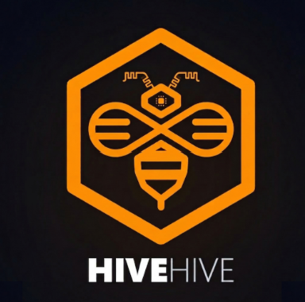

<h1 align="center">HiveHive</h1>

<div align="center">
  


  
  
  
  
  
  
  
</div>

<br>

Automated monitoring pipeline that captures images of wild bee hotels, classifies nest activity, and displays the results on an interactive dashboard. The system is built on ESP32-CAM hardware, a Python classification backend, and a React web application — fully containerized with Docker Compose.


<br>

## System Components

- **homepage** — React + Vite frontend, served on port `5173`
- **backend** — Node.js + Express API, served on port `3002`
- **classification-backend** — Python + Flask image classification service, port `8000`
- **duckdb-service** — Python + Flask database service, port `8002`
- **ESP32-CAM** — edge hardware module for image capture and upload

<br>

## Documentation

| Guide | Description |
| --- | --- |
| [Deployment Guide](documentation/service-deployment.md) | How to run all services with Docker Compose |
| [Homepage](documentation/homepage.md) | Frontend pages, routes, and backend connection |
| [ESP Deployment](documentation/esp-deployment.md) | ESP32 firmware flashing, WiFi setup, configuration |
| [API Usage](documentation/api-usage.md) | All API endpoints with example requests and responses |
| [Architecture](documentation/architecture.md) | System architecture, data flow, and design decisions |
| [Classification Backend](documentation/classification-backend.md) | Image classification pipeline details |
| [DuckDB & Data Model](documentation/duckDB.md) | Database schema and query reference |

<br>

## Quick Start

```bash
git clone https://github.com/schutera/highfive.git
cd highfive
```

Create a `.env` file in the root directory:

```env
DEBUG=true
DUCKDB_SERVICE_URL=http://duckdb-service:8000
```

Start all services:

```bash
docker compose up --build
```

See [Deployment Guide](documentation/service-deployment.md) for full setup instructions.

<br>

## Development

### Backend

```bash
cd backend
npm install
npm run dev
```

### Frontend

```bash
cd homepage
npm install
npm run dev        # runs on port 5173
```
