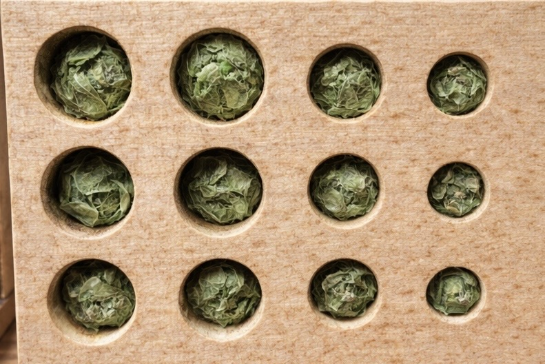
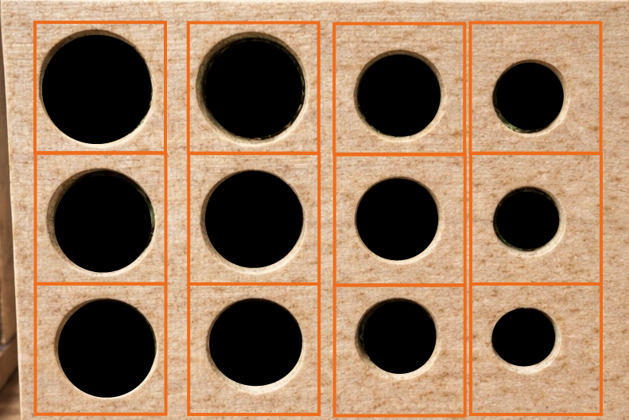
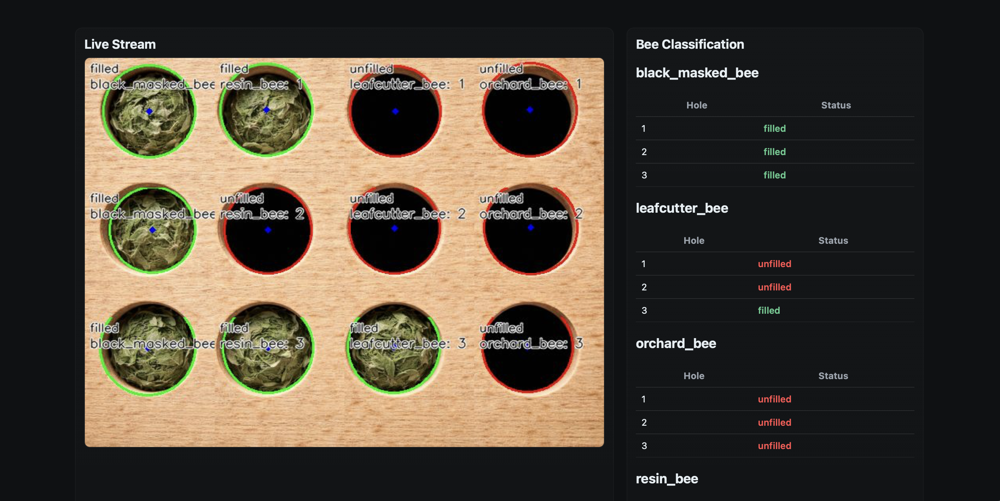

# Classification Backend

The service documented here is the **Classification Backend**,
responsible for processing and classifying images captured by the
ESP32-based Hive modules.

The service is the "center piece" of the project and preforms the following tasks:

- Receiving images from ESP-camera modules
- Processing images to detect nesting cells and classifying whether the cells are empty (0) or occupied (1)
- Providing a debug dashboard for development
- Forwarding classification results to downstream systems

The service is implemented as a **REST API** and forms a central
component of the data pipeline between the edge devices and the database
system.

<br>

# 1. Hive Modules as Data Source

The images used for classification originates from the **Hive modules**.

The Hive modules are artificial nesting cells designed for wild bees. These bees use small cavities as nesting sites where they deposit pollen and lay their eggs. After entering the nest, the entrance of the cell is sealed, indicating that the nest is occupied.

In this project, the hive modules are equipped with camera systems that capture images of the nesting holes. By analyzing whether a nesting hole is open or sealed, the system can automatically monitor the nesting activity and brood development of wild bees.

A Hive module contains multiple nesting areas and **three nesting tubes per bee species**.
All Hive modules are standardized in geometric arrangement of the cells which is also part of the HiveHive project.

<div align="center">
  
</div>

_Figure 1: Example of a Hive module equipped with ESP32-camera. (Mark Schutera, 2026)_

The four bee species considered are:

- Black Masked Bee
- Leafcutter Bee
- Orchard Bee
- Resin Bee

The modules are photographed using an **ESP32 camera module**.

Because the geometry of the nesting aid is fixed, the captured image can
later be deterministically divided into individual tiles. As the physical Hive module is not fully developed yet, there was not training data available. Thus, sample images were generated using AI for developing the image classification functionality.

<div align="center">
  
</div>

_Figure 2: View of the Hive module from ESP-Cam perspective used for development - all nests are occupied. (AI-Generated)_

<br>

# 2. Technologies Used

## Python

The classification system was implemented as a separate microservice in Python instead of being integrated directly into the Next.js backend.

One reason is that the classification backend already existed in an earlier development phase of the project, before the Next.js backend was introduced. Keeping it as a separate service allowed the existing functionality to be reused without major changes.

Another reason is that the service performs image processing tasks, which are easier to implement in Python. Python provides well-established libraries for computer vision, such as OpenCV, which simplify the development of image analysis algorithms.

Separating the classification logic into its own service also improves the overall system structure. The web backend can focus on handling user requests and frontend communication, while the classification service is responsible only for processing images. This makes the system easier to maintain and extend in the future.

## Flask

The REST API of the service was implemented using the **Flask** web
framework.

Flask is a lightweight Python framework well suited for building small
microservices.\
Unlike larger frameworks such as Django, Flask offers a flexible
architecture and requires minimal configuration.

Advantages of Flask in this project include:

- simple implementation of REST APIs
- low complexity
- easy integration with Python-based data processing
- well suited for microservice architectures

## OpenCV

The **OpenCV (Open Source Computer Vision Library)** is used for image
processing.

OpenCV provides a large collection of algorithms for image analysis,
object detection, and geometric transformations.

Within this project OpenCV is used for:

- image preprocessing
- circle detection
- color and brightness analysis

<br>

# 3. Architecture of the Classification Backend

The service follows a modular design and a simple microservice
structure.

    classification-backend
    │
    ├── app.py
    ├── routes
    │   ├── dashboard.py
    │   ├── preview.py
    │   └── result.py
    │
    └── services
        ├── aws.py
        ├── duckdb.py
        ├── state.py
        └── circle_detection
            ├── detect_circle.py
            └── new_bee_detection.py

Each module has clearly defined responsibilities:

- `app.py` Service initialization and API
- `routes` HTTP endpoints
- `circle_detection` Image processing and classification
- `aws` Image storage
- `duckdb` Communication with the database system

## 3.1 Data Flow in the System

The central entry point of the service is the endpoint:

    POST /upload

This endpoint is called by the Hive modules whenever a new image is
captured.
Each request sent by a Hive module must contain the following information:

| Parameter | Description                               |
| --------- | ----------------------------------------- |
| `image`   | Captured image of the hive module         |
| `mac`     | Unique identifier of the Hive module      |
| `battery` | Current battery level of the device as int (0–100) |

These parameters allow the system to associate the captured image with the correct hardware module and to monitor the operational state of the device.

The data flow within the system can be summarized as follows:

1.  A Hive module sends an image to the `/upload` endpoint.
2.  The image is stored locally.
3.  The image processing pipeline is started.
4.  Individual nesting cells are analyzed.
5.  A structured JSON result is created.
6.  Optionally the image is stored in an object storage system.
7.  The classification results are forwarded to the DuckDB service from where on the frontend is taking over.

<br>

# 4. Image Processing Pipeline

After an image upload, the following processing steps are executed:

1.  Store the image in the local file system
2.  Divide the image into predefined image tiles
3.  Detect nesting cells per tile
4.  Classify individual cells
5.  Generate a structured JSON output

## 4.1 Image Tiling

Because the structure of the Hive modules is fixed, the image can be
deterministically divided into multiple regions.

The full image is split into **12 tiles**.

These correspond to:

- 4 bee species
- 3 nesting tubes each

The split is based on fixed pixel coordinates which can be easily adjusted in `new_bee_detection.py`: `REGIONS` to fit real training images later on.

<div align="center">
  
</div>

_Figure 3: View of the Hive module from ESP-Cam perspective with the cutout image tiles - all nests are empty. (AI-Generated)_

## 4.2 Circle Detection

Within each tile, a circle detection algorithm is applied to identify the
opening of the nesting tube. For this purpose the **Hough Circle Transform**
is used.

The algorithm works in several steps:

1. Convert the image to grayscale
2. Apply a median filter to reduce image noise
3. Detect edge structures within the image
4. Identify circle candidates based on the detected edges

The Hough transform is particularly suitable for detecting circular
structures and therefore works well for identifying the round openings
of the nesting tubes in the hive modules.

Another reason for choosing this approach is that the geometry of the
hive modules is highly standardized. Since the nesting tubes always
appear as circular shapes in approximately known positions, a classical
computer vision approach such as the Hough transform provides a simple
and efficient solution.

At the current stage of development this component should be considered
**prototypical**.

## 4.3 Nest Cell Classification

After circle detection, the nesting cells are classified.

The goal of this step is a **binary classification**:

```
1 = Cell is filled
0 = Cell is empty
```

The classification is currently performed using a rule-based approach
based on simple color and brightness features within the detected circle
region.

The following image properties are analyzed:

- brightness (Value channel in HSV color space)
- color saturation (Saturation channel)
- dominance of the green channel

Filled cells usually contain plant material such as leaves or pollen
mixtures. These materials often introduce stronger color saturation and
green components into the image region.

Empty cells, in contrast, typically appear darker and less saturated
because the interior of the tube is visible.

Similar to the circle detection stage, this classification approach is
currently **heuristic and prototype-based**. The parameters of both components were tuned mainly using
synthetic and AI-generated training images, as no large dataset of real
images from deployed hive modules was available during development.
Because of this limitation the detection logic is likely **overfitted to the available test images**.

For this reason the classification modules where intentionally designed
to be easily replaceable so that improved detection methods can be
integrated in future versions.

## 4.4 Future Development: Neural Network Based Classification

In future versions of the system the rule-based classification could be
replaced by a **neural network based image classification model**.

This would allow the model to better handle variations in lighting,
camera angle, and environmental conditions.

Such an approach would likely provide more robust and accurate
classification results compared to the current heuristic solution.

Because the image processing pipeline was implemented as a modular
component, the current prototype can be replaced by a machine learning
model without major changes to the overall system architecture.

## 4.5 Structure of Classification Results

The classification results are stored as a JSON object.

```json
{
  "black_masked_bee": { "1": 1, "2": 0, "3": 1 },
  "leafcutter_bee": { "1": 1, "2": 1, "3": 0 },
  "orchard_bee": { "1": 0, "2": 1, "3": 1 },
  "resin_bee": { "1": 1, "2": 1, "3": 1 }
}
```

This structure allows simple downstream processing by other services.

At this stage the classification result is only returned as a binary value (`0` or `1`).  
A value of `1` indicates that a nesting cell is **filled**, while `0` indicates that the cell is **empty**.

In future revisions the system is intended to output a value between **0–100%** representing the **estimated brood development progress** inside a nesting tube.

Once a bee seals a tube after laying an egg and providing pollen, the larva develops over several weeks. By tracking the time since a tube was first detected as sealed, the system could estimate the development progress.

The classification backend would therefore mainly detect **state changes (open/sealed)**, while downstream systems could calculate the estimated development progress over time.

<br>

# 5. Debug Dashboard

A debug dashboard was implemented to visualize classification results for development.

The dashboard provides:

- live preview of the camera image
- visualization of classification results
- automatic updates

The following endpoints are used:

    /debug/dashboard (For the full dashboard)
    /debug/preview (Live image only)
    /debug/result (Classification result only)

The dashboard is intended only for development and debugging purposes. It will always display the latest uploaded image to the `/upload` route.

<div align="center">
  
</div>

_Figure 4: Debug Dashboard showing the latest classification result from the upload route_

<br>

# 6. Image Storage

Image storage is optional.

If an object storage system (for example **AWS S3** or **MinIO**) is
configured in the environment settings, incoming raw images are
automatically uploaded to a storage bucket.

This could potentially be used for:

- creation of training datasets
- validation of classification results
- analysis of misclassifications
- visualization of original images in frontend applications

<br>

# 7. Integration with the Database System

The classification results are forwarded to the DuckDB service for
persistent storage.

For each uploaded image the following information is stored:

- module identifier (`mac`)
- timestamp of the observation
- bee species and nesting tube index
- classification result (`0` = empty, `1` = filled)

These records allow the system to track nest occupancy and brood
development over time.

The registration of new hive modules is handled directly in the DuckDB docker service. Requests for registrations should be sent to it directly. Incoming images from modules are then matched using the module identifier.

<br>

# 8. Future Improvements

Several improvements are planned for future versions of the classification backend.

**1. Real training data**

The current image processing pipeline was mainly developed using AI-generated images, since no real images from deployed hive modules were available during development. In future deployments, real image data can be collected and used to improve and validate the detection algorithms.

**2. Neural network based classification**

The current rule-based classification could be replaced by a neural network model. Such models could learn relevant visual features directly from data and improve robustness under different lighting conditions and camera perspectives.

**3. Improved circle detection**

The Hough transform works well under controlled conditions but may become less reliable when image quality varies. Future versions could use more advanced detection methods or object detection models.

**4. Brood development estimation**

Currently the system only detects whether a nesting tube is empty or filled. In future versions this could be extended to estimate a **0–100% brood development progress** based on the time since a tube was first detected as sealed.

<br>

# 9. References

Bradski, G., & Kaehler, A. (2008). _Learning OpenCV_. O’Reilly Media.

OpenCV Documentation. https://docs.opencv.org

Python Software Foundation. _Python Documentation_. https://docs.python.org

DuckDB Documentation. https://duckdb.org/docs

Insektenhotels.net. _Warum sind in einem Insektenhotel Löcher verschlossen?_.  
https://insektenhotels.net/insektenhotel-loecher-verschlossen/
