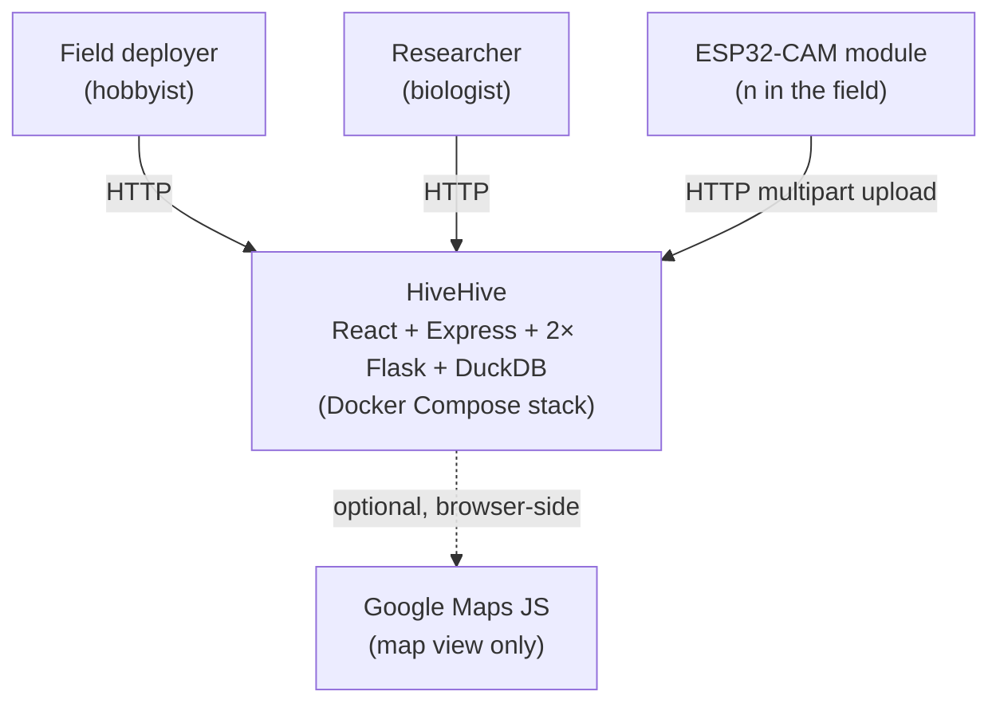

# 3. Context and Scope

This chapter shows HiveHive's boundary: the systems it talks to, the
people who use it, and the data that crosses each interface.

## System context

## Actors and external systems

| Actor / system | Direction | Protocol | What it carries |
|----------------|-----------|----------|-----------------|
| **ESP32-CAM module** | inbound | `POST /upload` (multipart) to `image-service:8000` | One JPEG + `mac` + `battery` + optional `logs` (JSON telemetry) |
| **Browser (operator/researcher)** | inbound | HTTP/HTML to `homepage:5173`, then JSON to `backend:3002` | Dashboard reads, optional admin telemetry reads |
| **Google Maps JavaScript API** | outbound (browser-side) | Loaded by `homepage` for the map view | API key currently hardcoded in `ESP32-CAM/esp_init.cpp:362` — see [issue #18](https://github.com/schutera/highfive/issues/18) and [11-risks-and-technical-debt](../11-risks-and-technical-debt/README.md) |
| **GitHub Actions** | outbound (CI runs in GitHub) | git + container builds | All seven jobs in `.github/workflows/tests.yml` |
| **DockerHub / `docker.io`** | outbound (build time) | Pulls Python, Node base images | No registry credentials needed for public images |

## In-scope

- Image capture, upload, persistence, and display for one deployment
  serving one beekeeper or research site.
- Per-module telemetry capture and admin-gated inspection.
- ESP32-CAM firmware flashing and configuration via the
  `ESP32-Access-Point` Wi-Fi access point (see
  [esp-flashing](../07-deployment-view/esp-flashing.md)).

## Out of scope

- Multi-tenancy. One stack, one tenant.
- Real-time push to clients. Dashboard is poll-based.
- Identity provider integration (OAuth, SSO). Auth is a single shared
  API key — see [auth](../08-crosscutting-concepts/auth.md).
- Production-grade classification. Today's classifier is a stub;
  MaskRCNN integration is planned but the contract shape is fixed.
- OTA firmware updates. Tracked as a feature request:
  [issue #26](https://github.com/schutera/highfive/issues/26).
