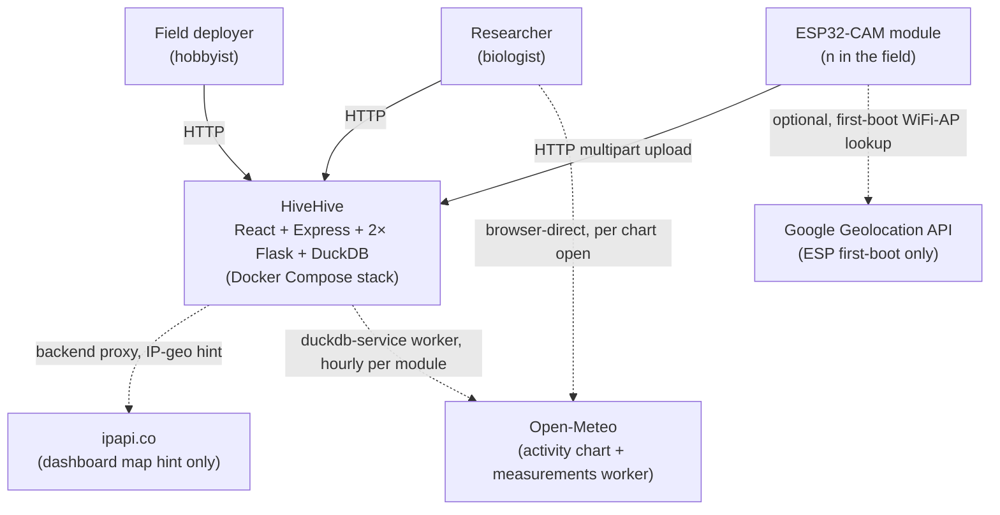

# 3. Context and Scope

This chapter shows HiveHive's boundary: the systems it talks to, the
people who use it, and the data that crosses each interface.

## System context

## Actors and external systems

| Actor / system                    | Direction                                      | Protocol                                                                                                                                                                                                                                                                                                                                                                                                                            | What it carries                                                                                                                                                                                                                                                                                                                                                                                                                                                                                                                                                                                                                                                                                                                                                                                                                      |
| --------------------------------- | ---------------------------------------------- | ----------------------------------------------------------------------------------------------------------------------------------------------------------------------------------------------------------------------------------------------------------------------------------------------------------------------------------------------------------------------------------------------------------------------------------- | ------------------------------------------------------------------------------------------------------------------------------------------------------------------------------------------------------------------------------------------------------------------------------------------------------------------------------------------------------------------------------------------------------------------------------------------------------------------------------------------------------------------------------------------------------------------------------------------------------------------------------------------------------------------------------------------------------------------------------------------------------------------------------------------------------------------------------------ |
| **ESP32-CAM module**              | inbound                                        | `POST /upload` (multipart) to `image-service:8000`                                                                                                                                                                                                                                                                                                                                                                                  | One JPEG + `mac` + `battery` + optional `logs` (JSON telemetry)                                                                                                                                                                                                                                                                                                                                                                                                                                                                                                                                                                                                                                                                                                                                                                      |
| **Browser (operator/researcher)** | inbound                                        | HTTP/HTML to `homepage:5173`, then JSON to `backend:3002`                                                                                                                                                                                                                                                                                                                                                                           | Dashboard reads, optional admin telemetry reads                                                                                                                                                                                                                                                                                                                                                                                                                                                                                                                                                                                                                                                                                                                                                                                      |
| **Google Geolocation API**        | outbound (ESP-side)                            | `POST https://www.googleapis.com/geolocation/v1/geolocate` from `ESP32-CAM/esp_init.cpp`'s `getGeolocation` at first boot                                                                                                                                                                                                                                                                                                           | WiFi-AP fingerprint → (lat, lng, accuracy). API key is build-time injected via `GEO_API_KEY` macro (no longer in source) — see [auth.md "Third-party API keys: Geolocation"](../08-crosscutting-concepts/auth.md#third-party-api-keys-geolocation)                                                                                                                                                                                                                                                                                                                                                                                                                                                                                                                                                                                   |
| **ipapi.co** (free tier)          | outbound (backend-side)                        | `GET https://ipapi.co/<ip>/json/` from `backend/src/userLocation.ts`'s `lookupUserLocation` per dashboard visitor (cached 1h)                                                                                                                                                                                                                                                                                                       | Visitor IP → coarse (lat, lng). Used solely as the "first-paint near you" centre for the dashboard map (issue #14). No key required; degrades gracefully to a 503 → default map centre if rate-limited. See [ADR-012](../09-architecture-decisions/adr-012-dashboard-ip-geo-hint.md).                                                                                                                                                                                                                                                                                                                                                                                                                                                                                                                                                |
| **Open-Meteo**                    | outbound (browser-side **and** duckdb-service) | (1) `GET https://api.open-meteo.com/v1/forecast?...` from `homepage/src/services/weather.ts`'s `fetchHourlyWeather`, one call per `ActivityWeatherChart` mount. (2) `GET https://api.open-meteo.com/v1/forecast` (live gap-fill, `past_days=2`) and `GET https://archive-api.open-meteo.com/v1/archive` (historical backfill) from `duckdb-service/services/weather_worker.py`'s `run_weather_fetch`, one call per module per hour. | Module lat/lng (already a public, ~1 km-generalized value — [ADR-020](../09-architecture-decisions/adr-020-coordinate-generalization.md)) → hourly temperature, humidity, precipitation. No key required; CORS open. The browser-direct path drives the chart overlay; the server-side path lands rows in the `measurements` table tagged `source='open-meteo'` (live) or `'open-meteo-backfill'` (historical) so anomaly detection (#116), hatching prediction (#117), and baselines (#115) can join weather to activity over arbitrary windows. Both paths degrade to "weather unavailable" / empty buckets when the API is unreachable. See [ADR-015](../09-architecture-decisions/adr-015-weather-correlation.md) (browser) and [ADR-017](../09-architecture-decisions/adr-017-external-weather-source.md) (server-side worker). |
| **GitHub Actions**                | outbound (CI runs in GitHub)                   | git + container builds                                                                                                                                                                                                                                                                                                                                                                                                              | All eight jobs in `.github/workflows/tests.yml`                                                                                                                                                                                                                                                                                                                                                                                                                                                                                                                                                                                                                                                                                                                                                                                      |
| **DockerHub / `docker.io`**       | outbound (build time)                          | Pulls Python, Node base images                                                                                                                                                                                                                                                                                                                                                                                                      | No registry credentials needed for public images                                                                                                                                                                                                                                                                                                                                                                                                                                                                                                                                                                                                                                                                                                                                                                                     |

## In-scope

- Image capture, upload, persistence, and display for one deployment
  serving one beekeeper or research site.
- Per-module telemetry capture and admin-gated inspection.
- ESP32-CAM firmware flashing and configuration via the
  `ESP32-Access-Point` Wi-Fi access point (see
  [esp-flashing](../07-deployment-view/esp-flashing.md)).

## Out of scope

- Multi-tenancy. One stack, one tenant.
- Real-time push to clients. Dashboard is poll-based.
- Identity provider integration (OAuth, SSO). Auth is a single shared
  API key — see [auth](../08-crosscutting-concepts/auth.md).
- Production-grade empty/sealed classification. A learned detector
  already localizes holes for snips (ADR-027), but the empty/sealed
  classifier is a stub; a learned classifier is planned and the
  contract shape is fixed.
- OTA firmware updates. Tracked as a feature request:
  [issue #26](https://github.com/schutera/highfive/issues/26).
