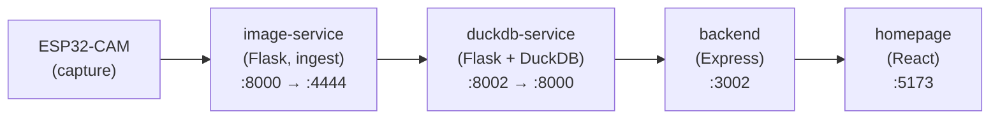

# 4. Solution Strategy

The high-level approach behind HiveHive — the shape of the system and
the strategic choices made early. For the actual building blocks, see
[05-building-block-view](../05-building-block-view/README.md). For the
why behind individual choices, see
[09-architecture-decisions](../09-architecture-decisions/README.md).

## Overall shape

A pipeline split into edge → ingestion → persistence → read aggregation → UI:

Five components, each owning one responsibility, each replaceable
without rewriting its neighbours. Inter-service URLs use Docker
service names so the topology is fixed by `docker-compose.yml`, not by
configuration drift.

## Strategic choices

| Choice | Rationale | ADR |
|--------|-----------|-----|
| **DuckDB-service is the sole DB writer** | An older variant let `image-service` open its own DuckDB connection; this caused write conflicts and broke the "one owner per resource" invariant. All persistence now goes via HTTP. | [ADR-001](../09-architecture-decisions/adr-001-duckdb-as-sole-writer.md) |
| **Pure C++ helpers under `ESP32-CAM/lib/`** | Most ESP firmware is hard to test on the CI host. Splitting URL parsing, ring-buffer, and telemetry serialisation into dependency-free libraries lets `pio test -e native` cover them on every CI run. | [ADR-002](../09-architecture-decisions/adr-002-esp-host-testable-lib.md) |
| **Single `HIGHFIVE_API_KEY` for both API and admin gates** | Two separate secrets in dev mean two more env vars to forget. Reusing the same key under different header names (`X-API-Key`, `X-Admin-Key`) keeps onboarding to one secret without losing the gating semantics. | [ADR-003](../09-architecture-decisions/adr-003-shared-api-key-for-admin.md) |
| **Docker Compose for the dev stack** | Lets a contributor go from `git clone` to a working multi-service environment in one command. Production deploys can use the same images on Compose, Swarm, or Kubernetes — image boundaries are unchanged. | (no ADR — convention) |
| **`@highfive/contracts` shared TypeScript package** | Frontend and backend used to declare separate `Module` / `NestData` types and they drifted. Moving the canonical types into a workspace package made drift a TypeScript compile error. | (no ADR — convention; see [api-contracts](../08-crosscutting-concepts/api-contracts.md)) |

## Service topology

Concrete service map and ports live in
[05-building-block-view/README.md](../05-building-block-view/README.md).
The container topology, shared volume, and inter-service URLs live in
[07-deployment-view/docker-compose.md](../07-deployment-view/docker-compose.md).

## Known trade-offs

These were deliberate choices, not bugs. They're documented here so
future contributors don't "fix" them without context.

- **Backend re-fetches on every request.** `backend.ModuleReadModel`
  is stateless: every `/api/modules*` call fans out to duckdb-service
  via `Promise.allSettled`. Simple, partial-failure-tolerant, not
  optimised for high QPS.
- **Stub classifier ships in production.** `image-service` calls
  `stub_classify()` returning random 0/1 per (bee_type, nest index).
  This is the contract shape MaskRCNN will fill — the data flow works
  end-to-end before classification quality matters.
- **Dev API key as fallback.** `hf_dev_key_2026` is the dev-mode
  default. **Never** ship this in a production deploy — override
  `HIGHFIVE_API_KEY` (see [02-constraints](../02-constraints/README.md)).

## Recommended next architecture steps

1. Async queue between upload and classification for burst handling.
2. Structured observability — central logs + trace IDs across services.
3. Drop dev-key fallback in production builds.
4. DuckDB schema migration / versioning strategy.
5. OTA firmware updates ([issue #26](https://github.com/schutera/highfive/issues/26)).
