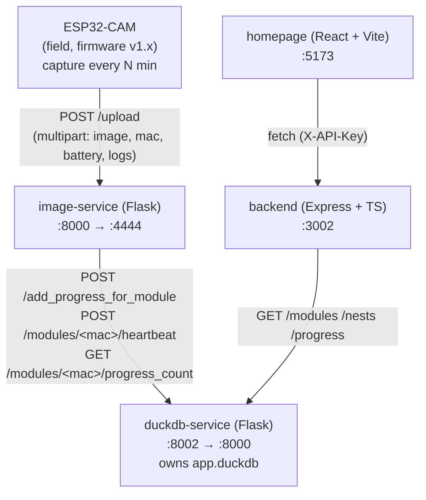

# 5. Building Block View

The five components that make up HiveHive, the shared volume between
two of them, and where each piece lives in the repo.

## Service map

| Service          | Stack                           | Host:Container | Directory         | Detail |
| ---------------- | ------------------------------- | -------------- | ----------------- | ------ |
| `homepage`       | React 19 + Vite + TS + Tailwind | `5173:5173`    | `homepage/`       | [homepage.md](homepage.md) |
| `backend`        | Node 20 + Express + TS          | `3002:3002`    | `backend/`        | [backend.md](backend.md) |
| `image-service`  | Python 3.11 + Flask             | `8000:4444`    | `image-service/`  | [image-service.md](image-service.md) |
| `duckdb-service` | Python 3.11 + Flask + DuckDB    | `8002:8000`    | `duckdb-service/` | [duckdb-service.md](duckdb-service.md) |
| `ESP32-CAM`      | C++17 + Arduino + PlatformIO    | n/a (edge)     | `ESP32-CAM/`      | [esp32cam.md](esp32cam.md) |

Internal calls use Docker service names (e.g. `http://duckdb-service:8000`),
**not** `localhost`. The DuckDB file lives in the named volume
`duckdb_data`, mounted at `/data` in both `image-service` and
`duckdb-service`. See
[07-deployment-view/docker-compose.md](../07-deployment-view/docker-compose.md).

## Topology

Per-service endpoints and behaviour live in the detail files linked
above and in [api-reference.md](../api-reference.md).

## Where things live

For per-file orientation when working in a specific area:

| Area                               | Path                                                           |
| ---------------------------------- | -------------------------------------------------------------- |
| Shared TS contracts                | `contracts/src/index.ts` (npm workspace `@highfive/contracts`) |
| Backend Express entry              | `backend/src/server.ts`                                        |
| Backend route handlers             | `backend/src/app.ts` (+ `auth.ts`, `duckdbClient.ts`)          |
| Backend tests                      | `backend/tests/*.test.ts`                                      |
| Homepage pages / components        | `homepage/src/pages/`, `homepage/src/components/`              |
| Homepage tests                     | `homepage/src/__tests__/*.test.tsx`                            |
| Homepage API client                | `homepage/src/services/`                                       |
| Image service Flask app            | `image-service/app.py`                                         |
| Image service routes / services    | `image-service/routes/`, `image-service/services/`             |
| Image service tests                | `image-service/tests/test_*.py`                                |
| DuckDB service Flask app           | `duckdb-service/app.py`                                        |
| DuckDB schema / models             | `duckdb-service/db/`, `duckdb-service/models/`                 |
| DuckDB service tests               | `duckdb-service/tests/test_*.py`                               |
| ESP32-CAM firmware entry           | `ESP32-CAM/ESP32-CAM.ino`                                      |
| ESP32-CAM pure C++ (host-testable) | `ESP32-CAM/lib/{url,ring_buffer,telemetry}/`                   |
| ESP32-CAM Unity host tests         | `ESP32-CAM/test/test_native_*/`                                |
| End-to-end pipeline test           | `tests/e2e/test_upload_pipeline.py`                            |
| E2E isolated compose stack         | `tests/e2e/docker-compose.test.yml` (ports +1000)              |
| Mock ESP driver                    | `tools/mock_esp.py`                                            |
| Compose stack                      | `docker-compose.yml`                                           |
| CAD / laser DXFs                   | `assets/`                                                      |
