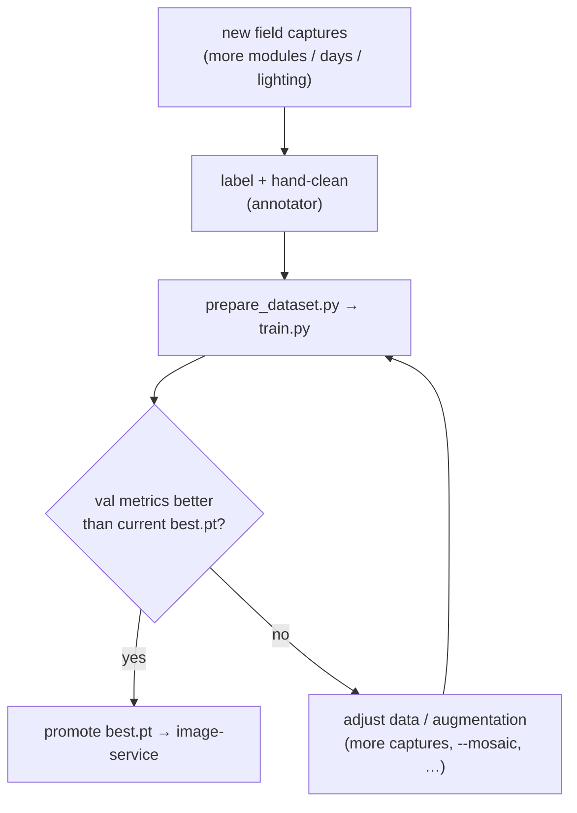

# Hole-detection model & training pipeline

How the ML model that powers per-nest **hole detection** (#165) is labelled, trained, and
retrained. The model locates every nest hole (empty or filled) in an ESP32-CAM block capture so
`image-service` can crop a per-nest snip from each. It replaces the classical `HoughCircles`
detector in `image-service/services/hole_detection.py`, which could not find holes on real
captures (a single fixed radius band, no block ROI — see
[chapter 11 → Lessons learned](../11-risks-and-technical-debt/README.md)).

- **Decision record:** [ADR-027](../09-architecture-decisions/adr-027-hole-detection-model.md)
  (why a learned YOLO segmenter, why DINO+SAM labelling, why ONNX inference).
- **Hands-on runbook + scripts:** [`dev-tools/ml_hole_detection/`](../../dev-tools/ml_hole_detection/README.md).
- **Runtime seam (integrated):** the trained model is exported to ONNX and runs behind
  `image-service`'s `HoleDetector().detect()` through the lean `onnxruntime` — no torch/ultralytics
  in the service image. The upload pipeline, storage, serving, and wire shapes are unchanged (see
  [image-service.md](image-service.md)). The model **localizes** holes; the empty-vs-sealed call is
  deferred, so each snip carries `state = "undetermined"` and the progress bars keep the stub.

## Pipeline overview

```mermaid
flowchart LR
    CAP["field captures<br/>(ESP32-CAM block images)"] --> ANN
    ANN["digitalsreeni-image-annotator<br/>Grounding DINO + SAM 2.1<br/>label holes, hand-clean fixtures"] --> EXP{"export"}
    EXP -->|"COCO JSON"| PREP
    EXP -->|"YOLO v5+"| PREP
    PREP["prepare_dataset.py<br/>reformat + 80/20 split"] --> DS["dataset/holes_seg<br/>images + labels (train/val)<br/>+ data.yaml"]
    DS --> TRAIN["train.py<br/>YOLO26n-seg + augmentation<br/>early-stop on val plateau"]
    TRAIN --> BEST["best.pt<br/>+ results.csv / results.png"]
    BEST --> EXPO["export_onnx.py<br/>best.pt to end2end ONNX<br/>(opset 19, NMS-free)"]
    EXPO --> SVC["image-service<br/>onnxruntime behind<br/>HoleDetector().detect()"]
```



The labelling tool is the open-source **digitalsreeni-image-annotator**
(<https://github.com/bnsreenu/digitalsreeni-image-annotator>) — a PyQt6 app with Grounding-DINO +
SAM 2.1 AI-assisted labelling. Label a single class `hole` and hand-clean any fixture/wing holes
(the screws/mounts outside the nest block); the model then learns to ignore them, so **no
inference-time ROI is needed**.

## Steps & commands

Run from [`dev-tools/ml_hole_detection/`](../../dev-tools/ml_hole_detection/README.md). Deps are
pinned in its `requirements.txt` (offline/dev only — **not** in any service image).

```powershell
# 0. one-time: venv + deps (+ optional CUDA torch — see requirements.txt)
cd dev-tools\ml_hole_detection
python -m venv .venv
.\.venv\Scripts\python.exe -m pip install -r requirements.txt

# 1. label in the annotator → export COCO JSON (recommended) or YOLO v5+

# 2. build the split dataset (COCO input shown; use --yolo <dir> for a YOLO export)
.\.venv\Scripts\python.exe prepare_dataset.py --coco <export>\annotations.json

# 3. train (YOLO26n-seg, auto GPU/CPU, early-stop on val plateau)
.\.venv\Scripts\python.exe train.py
#   → runs\<name>\weights\best.pt  + per-epoch train/val losses in results.csv / results.png

# 4. export the trained weights to the ONNX the service runs (bakes into the image)
.\.venv\Scripts\python.exe export_onnx.py
#   → image-service\models\hole_detector.onnx ; then: docker compose up -d --build image-service
```

### Why the `prepare_dataset.py` step exists

It is a **format + split** step only — no content is changed, every labelled hole is carried 1:1,
and there is no ROI/filtering:

- Ultralytics cannot train on a COCO JSON directly — it needs per-image YOLO `.txt` labels +
  `data.yaml` + an `images|labels/{train,val}` layout.
- The annotator's **YOLO export puts every image in `train` with an empty `val`**, which
  Ultralytics rejects (`val: Error loading data from .../images/val`). `prepare_dataset.py`
  adds the deterministic 80/20 split either way (`--coco` or `--yolo`). Upstream request to make
  the split configurable on export: [annotator issue #83](https://github.com/bnsreenu/digitalsreeni-image-annotator/issues/83).

## Training configuration

- **Model:** `yolo26n-seg` (instance segmentation, single class `hole`). Nano size keeps the
  deployed ONNX small (~11 MB) and CPU inference fast (~50 ms via `onnxruntime`) — far under the
  upload path's nginx 60 s timeout.
- **Augmentation** (on by default, all label-safe for a single geometry-independent class):
  rotation, zoom, translation, shear, perspective, horizontal **and vertical** flip (the block
  mounts either orientation), brightness + colour-temperature (hue) + saturation jitter, mosaic,
  and contrast/CLAHE via the auto-applied `albumentations` pipeline.
- **Validation + early stop:** validation runs every epoch (per-epoch train + val losses in
  `results.csv`, plotted in `results.png`); `--patience 40` stops when the val metric plateaus.

## Retraining loop

New field models will add captures over time; retrain by re-running the same two scripts.



> Split caveat: a single module's captures are a dense time-lapse, so a random split can put
> near-duplicate frames in both train and val (slightly optimistic val loss). For a stricter
> held-out measure, reserve a contiguous time block or a whole separate module as val.

## Current model (baseline)

YOLO26n-seg on a 97-capture hand-cleaned set spanning two block geometries (21-hole `7/5/5/4`
and 16-hole `4×4`), early-stopped at epoch 176/216 (~6 min on an RTX 4070). Held-out (20 val
images, 405 holes):

|      | Precision | Recall | mAP50 | mAP50-95 |
| ---- | --------- | ------ | ----- | -------- |
| Box  | 0.969     | 0.973  | 0.993 | 0.905    |
| Mask | 0.966     | 0.970  | 0.993 | 0.67     |

It detects every hole on unseen captures across the warm/dark/daylight range and both
geometries, with no fixture/wing false positives.

## Runtime inference (integrated)

The model is **live in `image-service`**. `export_onnx.py` converts `best.pt` to an end2end ONNX
(opset 19, baked into the image at `image-service/models/hole_detector.onnx`); the detector runs
it through the lean `onnxruntime` — **no torch/ultralytics in the service image**. Per upload
(`image-service/services/hole_detection.py`):

1. Letterbox the capture to 640×640, run the model (~50 ms CPU, far under the nginx 60 s ceiling).
2. The export is NMS-free, so `output0` is `[1, 300, 4+1+1+32]` =
   `[x1, y1, x2, y2, conf, cls, *mask_coeffs]` in letterboxed px. Read the **box** columns (snips
   are rectangular crops), un-letterbox, drop sub-0.25-confidence rows, and apply one conservative
   NMS pass (IoU 0.7) to remove export-precision duplicate boxes — provably never merging distinct
   neighbours, whose box IoU is < 0.6 on the real blocks.
3. Cluster holes into rows, label bee type by **median radius ascending** (orientation-robust), and
   index nests left-to-right — **no per-row cap**, so the irregular 7/5/5/4 (21-hole) and 4×4
   (16-hole) blocks both keep every hole.
4. Crop one snip per hole. The ONNX parse is verified bit-for-bit against ultralytics' own
   inference on the real captures by the committed
   [`verify_onnx_parity.py`](../../dev-tools/ml_hole_detection/verify_onnx_parity.py).

**Deferred:** the model is a single-class `hole` _localizer_, so empty-vs-sealed is not called.
Each snip carries `state = "undetermined"` (a neutral "Detected" badge) and `classification` is
left empty, so `UploadPipeline` keeps the stub for the species progress bars while the snips are
real. A learned empty/sealed classifier is the next step. The snip plumbing (`duckdb-service`
`nest_detections`, backend `/api/snips` + `/api/modules/:id/snips`, the `NestSnip` contract,
homepage `NestSnipGrid`) is reused unchanged; the `undetermined` state was threaded through each
of those layers (each independently validates the state enum).

> **Nest identity & the snip grid is per-capture, not per-tube.** The model's per-row hole count
> can vary by ±1 frame-to-frame, so the dashboard read (`duckdb-service GET /detections`) folds to
> the **single most-recent capture** per module — a nest missed in one frame disappears rather than
> latching a stale crop from an older capture. Within a capture, `nest_index` is _positional_
> (left-to-right inside a diameter-row), not a durable physical-tube identity: "nest 3" need not be
> the same hole across captures. That is fine for the current-state grid but is a known limitation
> for the per-nest time-lapse (#166), which needs a stable nest identity (e.g. tracking
> by position, not just re-indexing each frame).

### Per-nest time-lapse (#166 phase 3, feature 1)

Tapping a snip in `NestSnipGrid` opens `SnipTimelapseModal`, which scrubs that one hole across
captures. The read is the inverse of the grid fold: `duckdb-service GET /detections/timeline`
returns **every capture for one `(module_id, bee_type, nest_index)`**, oldest first (one frame per
source `filename`), surfaced by `backend GET /api/modules/:id/snips/:beeType/:nestIndex/timeline`
and `api.getSnipTimeline(...)`. `nest_detections` is append-only, so the history is already there —
this is a read endpoint + a slider, no schema change.

Identity caveat (above) applies: the time-lapse groups by `(bee_type, nest_index)`, the best
identity available today. When the per-row hole count is stable across captures this tracks the
same physical hole; when it drifts, a frame may show a neighbour. Position-based tracking would
harden this and is the natural follow-up.

Because real uploads never run in dev/CI, `nest_detections` is **seeded** there: five captures of
Garten 12's leafcutter nest 1 walking `empty → undetermined → sealed`
(`duckdb-service/db/schema.py`), paired with bundled demo crops in `image-service/demo_snips/` that
`image-service` copies into the shared snip volume on boot when `SEED_DATA=true`. Keep the seeded
`snip_filename`s in sync with the JPEGs. The Playwright spec `tests/ui/tests/snip-timelapse.spec.ts`
asserts the scrubber swaps the real rendered crop end-to-end.
