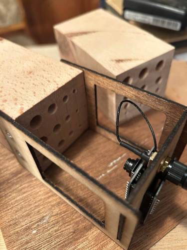

# Image Service

The **image-service** receives images captured by ESP32-CAM hive modules, stores them on a Docker volume, and forwards classification results to the DuckDB service for persistent storage.

Currently, the service returns **stub/dummy classification values**. A MaskRCNN-based model is planned to replace the stub with real predictions.

<br>

# 1. Hive Modules as Data Source

The images originate from **Hive modules** — artificial nesting cells designed for wild bees. These bees use small cavities as nesting sites where they deposit pollen and lay their eggs. After entering the nest, the entrance is sealed, indicating that the nest is occupied.

The hive modules are equipped with ESP32-CAM camera systems that capture images of the nesting holes. By analyzing whether a nesting hole is open or sealed, the system can monitor nesting activity.

A Hive module contains multiple nesting areas and **three nesting tubes per bee species**. The four bee species considered are:

- Black Masked Bee
- Leafcutter Bee
- Orchard Bee
- Resin Bee

<div align="center">
  
</div>

_Figure 1: Example of a Hive module equipped with ESP32-camera. (Mark Schutera, 2026)_

<br>

# 2. Service Architecture

```
image-service/
├── app.py                  # Flask app, /upload endpoint, stub classification
├── Dockerfile.dev
├── requirements.txt
├── pyproject.toml
├── README.md
└── services/
    └── duckdb.py           # HTTP client for DuckDB service
```

### Technologies
- **Python + Flask** — lightweight REST API
- **DuckDB client** — forwards classification results to the database service

<br>

# 3. API Endpoint

## POST /upload

The central entry point. Called by Hive modules whenever a new image is captured.

| Parameter | Type   | Description                                        |
| --------- | ------ | -------------------------------------------------- |
| `image`   | File   | Captured image of the hive module                  |
| `mac`     | String | Unique identifier (MAC address) of the Hive module |
| `battery` | Int    | Current battery level of the device (0–100)         |

### Data Flow

1. Hive module sends image to `/upload`
2. Image is saved to the Docker volume (`/data/images/`); a `.log.json`
   sidecar is written next to it if `logs` is present
3. Stub classification generates dummy results (4 bee types x 3 nests each)
4. Results are forwarded to `duckdb-service /add_progress_for_module`
5. Module `battery_level`, `image_count`, and `first_online` are
   updated via the **post-upload aggregate** at
   `POST /modules/<mac>/heartbeat` on `duckdb-service`
   (`image-service/services/duckdb.py:53` →
   `duckdb-service/routes/modules.py:266`). First-upload detection
   uses `GET /modules/<mac>/progress_count`. All DuckDB persistence
   flows through HTTP — `image-service` does not open its own DuckDB
   connection.

   `image-service` does **not** call `POST /heartbeat` (the telemetry
   channel). That endpoint is fired by firmware directly; the two
   endpoints share a name and a verb but do different things. See
   [duckdb-service.md](duckdb-service.md) and the
   [glossary](../12-glossary/README.md).

### Classification Result Format

```json
{
  "black_masked_bee": { "1": 1, "2": 0, "3": 1 },
  "leafcutter_bee": { "1": 1, "2": 1, "3": 0 },
  "orchard_bee": { "1": 0, "2": 1, "3": 1 },
  "resin_bee": { "1": 1, "2": 1, "3": 1 }
}
```

Values: `1` = filled/sealed, `0` = empty.

<br>

# 4. Planned: MaskRCNN Integration

The stub classification will be replaced with a **MaskRCNN model** that can:
- Detect individual nesting tubes in the image
- Classify each tube as empty or sealed
- Handle variations in lighting, angle, and environmental conditions

The service architecture is designed so the model can be integrated by replacing `stub_classify()` in `app.py` without changes to the rest of the pipeline.

In future revisions, the system may output values between **0–100%** representing estimated brood development progress, rather than binary 0/1.

<br>

# 5. Integration with Database System

Classification results are forwarded to the DuckDB service for persistent storage. For each uploaded image:

- Module identifier (`mac`)
- Bee species and nesting tube index
- Classification result (`0` = empty, `1` = filled)

These records allow tracking nest occupancy over time.

Module registration is handled directly by the DuckDB service. Incoming images are matched to modules using the MAC address identifier.

<br>

# 6. References

DuckDB Documentation. https://duckdb.org/docs

Python Software Foundation. _Python Documentation_. https://docs.python.org

Insektenhotels.net. _Warum sind in einem Insektenhotel Löcher verschlossen?_
https://insektenhotels.net/insektenhotel-loecher-verschlossen/
