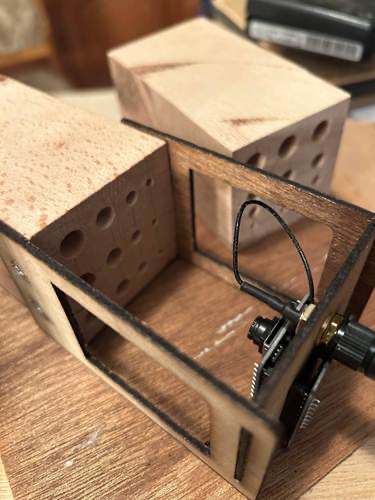

# Image Service

The **image-service** receives images captured by ESP32-CAM hive modules, stores them on a Docker volume, and forwards classification results to the DuckDB service for persistent storage.

Per-nest snips are produced by a **learned hole detector** (`HoleDetector`, #165 /
[ADR-027](../09-architecture-decisions/adr-027-hole-detection-model.md)): a
YOLO26n-seg model, exported to ONNX and run through the lean `onnxruntime`,
**locates** every nest hole and crops a per-nest **snip** from each. It replaces
the earlier OpenCV `HoughCircles` detector (ADR-026), which could not find holes
on real captures. The model only localizes, so each snip is `state =
"undetermined"` and the random `stub_classify()` still drives the species progress
bars — a learned empty-vs-sealed classifier is the next step. Training, export,
and the runtime parse:
[hole-detection-model.md](hole-detection-model.md).

<br>

# 1. Hive Modules as Data Source

The images originate from **Hive modules** — artificial nesting cells designed for wild bees. These bees use small cavities as nesting sites where they deposit pollen and lay their eggs. After entering the nest, the entrance is sealed, indicating that the nest is occupied.

The hive modules are equipped with ESP32-CAM camera systems that capture images of the nesting holes. By analyzing whether a nesting hole is open or sealed, the system can monitor nesting activity.

A Hive module contains multiple nesting areas and **four nesting tubes per bee species** (a 4×4 grid; the older "three" reflected a stale reference — see #165). The four bee species considered are:

- Black Masked Bee
- Leafcutter Bee
- Orchard Bee
- Resin Bee

<div align="center">
  
</div>

_Figure 1: Example of a Hive module equipped with ESP32-camera. (Mark Schutera, 2026)_

<br>

# 2. Service Architecture

```
image-service/
├── app.py                  # Flask app, /upload + /snips endpoints, detector wiring
├── Dockerfile.dev          # installs libglib2.0-0 (opencv) + libgomp1 (onnxruntime)
├── requirements.txt
├── pyproject.toml
├── README.md
├── models/
│   └── hole_detector.onnx  # learned YOLO26n-seg detector, run via onnxruntime (#165)
└── services/
    ├── duckdb.py           # HTTP client for DuckDB service (incl. record_detections)
    ├── hole_detection.py   # learned HoleDetector — ONNX inference + snip crop (#165)
    ├── image_guard.py      # JPEG magic-byte + dimension probe before save/decode (#228)
    └── upload_pipeline.py  # orchestrates detect → record progress → persist snips
```

### Technologies

- **Python + Flask** — lightweight REST API
- **onnxruntime** — runs the learned YOLO26n-seg hole detector (ONNX); no torch in the image
- **OpenCV (`opencv-python-headless`) + NumPy** — letterbox, box math, snip cropping
- **DuckDB client** — forwards classification + detection results to the database service

<br>

# 3. API Endpoint

## GET /logs

Internal admin-gated tail of this service's own recent stdout/stderr (#171) — an
in-memory ring fed by a stdout tee (`services/log_ring.py`). Requires
`X-Admin-Key`; the backend's `GET /api/admin/logs?service=image-service` proxies
here. See [ADR-021](../09-architecture-decisions/adr-021-admin-server-log-ring.md).

## POST /upload

The central entry point. Called by Hive modules whenever a new image is captured.

| Parameter | Type   | Description                                        |
| --------- | ------ | -------------------------------------------------- |
| `image`   | File   | Captured image of the hive module                  |
| `mac`     | String | Unique identifier (MAC address) of the Hive module |
| `battery` | Int    | Current battery level of the device (0–100)        |

### Data Flow

1. Hive module sends image to `/upload`
2. **Content validated first (2026-08 audit, for #228):**
   `services/image_guard.py::probe_jpeg` checks the JPEG magic bytes and
   the SOF-declared frame size (against `MAX_IMAGE_DIM`, default 4096px)
   — before anything is saved or decoded. A failure returns `400` with
   nothing persisted. Image is then saved to the Docker volume
   (`/data/images/`), always with a `.jpg` extension regardless of the
   uploaded filename (`services/paths.py::sanitize_upload_filename`); a
   `.log.json` sidecar is written next to it if `logs` is present
3. `HoleDetector` runs the learned ONNX model to locate every nest hole and
   crops a snip per hole into `/data/images/snips/` (`state = "undetermined"` —
   empty/sealed is deferred). On detection failure it returns nothing and the
   pipeline falls back to `stub_classify()`, so `/upload` never 500s.
4. The snips + bboxes are forwarded to `duckdb-service /record_detections`; the
   species progress bars run on the `stub_classify()` values forwarded to
   `duckdb-service /add_progress_for_module` (the model localizes only)
5. Module `battery_level` and `image_count` are updated via the
   **post-upload aggregate** at `POST /modules/<mac>/heartbeat` on
   `duckdb-service` (`first_online` is `COALESCE`-guarded since
   [#75](https://github.com/schutera/highfive/issues/75) and is no
   longer rewritten on every upload)
   (`image-service/services/duckdb.py`'s `heartbeat` →
   `duckdb-service/routes/modules.py`'s `heartbeat`). First-upload detection
   uses `GET /modules/<mac>/progress_count`. All DuckDB persistence
   flows through HTTP — `image-service` does not open its own DuckDB
   connection.

   `image-service` does **not** call `POST /heartbeat` (the telemetry
   channel). That endpoint is fired by firmware directly; the two
   endpoints share a name and a verb but do different things. See
   [duckdb-service.md](duckdb-service.md) and the
   [glossary](../12-glossary/README.md).

### Classification Result Format

```json
{
  "black_masked_bee": { "1": 1, "2": 0, "3": 1 },
  "leafcutter_bee": { "1": 1, "2": 1, "3": 0 },
  "orchard_bee": { "1": 0, "2": 1, "3": 1 },
  "resin_bee": { "1": 1, "2": 1, "3": 1 }
}
```

Values: `1` = filled/sealed, `0` = empty.

<br>

# 4. Hole detection (#165, ADR-027)

The `HoleDetector` (`services/hole_detection.py`,
[ADR-027](../09-architecture-decisions/adr-027-hole-detection-model.md)) runs a
learned **YOLO26n-seg** model, exported to ONNX and executed through the lean
`onnxruntime` (no torch/ultralytics in the image). Per upload it:

- **locates** every hole with the model (CPU ~50 ms): letterbox to 640², read the
  end2end `output0` boxes, un-letterbox, drop sub-0.25-confidence rows, and apply
  one conservative NMS (IoU 0.7) to drop export-precision duplicates;
- labels bee type **by measured hole diameter** (rows ordered by median radius →
  ascending size: black-masked < resin < leafcutter < orchard), indexing nests
  left-to-right with **no per-row cap** so the irregular 7/5/5/4 (21-hole) and 4×4
  (16-hole) blocks both keep every hole;
- **defers** the empty-vs-sealed call — each snip is `state = "undetermined"` and
  `classification` is left empty, so the species progress bars keep the stub;
- crops a per-nest **snip** (served at `GET /snips/:filename`, recorded via
  duckdb `POST /record_detections`).

This replaces the earlier OpenCV `HoughCircles` detector (ADR-026), which could
not find holes on real captures, and supersedes the earlier MaskRCNN idea (#112).
The architecture isolates the swap to `HoleDetector` — the upload pipeline,
storage, serving, and wire shapes are unchanged. Training, export, and the runtime
parse: [hole-detection-model.md](hole-detection-model.md).

In future revisions, the system may output values between **0–100%** representing estimated brood development progress, rather than binary 0/1.

<br>

# 5. Integration with Database System

Classification results are forwarded to the DuckDB service for persistent storage. For each uploaded image:

- Module identifier (`mac`)
- Bee species and nesting tube index
- Classification result (`0` = empty, `1` = filled)

These records allow tracking nest occupancy over time.

Module registration is handled directly by the DuckDB service. Incoming images are matched to modules using the MAC address identifier.

<br>

# 6. References

DuckDB Documentation. https://duckdb.org/docs

Python Software Foundation. _Python Documentation_. https://docs.python.org

Insektenhotels.net. _Warum sind in einem Insektenhotel Löcher verschlossen?_
https://insektenhotels.net/insektenhotel-loecher-verschlossen/
