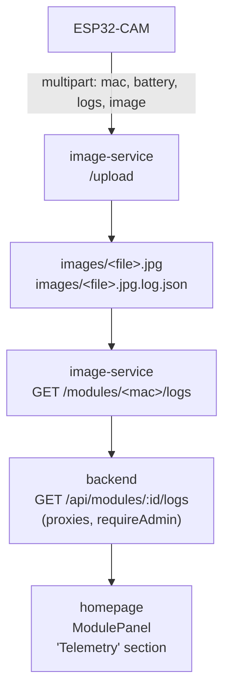

# ESP32-CAM Reliability & Telemetry

This document describes the reliability strategy, the heartbeat
telemetry channel, and the admin log-viewing flow.

The base architecture was introduced in **v1.0.0** and hardened by
PR 17 (firmware names `bumblebee`/`honeybee`/`mason`/`carpenter` —
see [ADR-006](../09-architecture-decisions/adr-006-bee-name-firmware-versioning.md)).
The end-state is captured in
[ADR-007](../09-architecture-decisions/adr-007-esp-reliability-breaker-and-daily-reboot.md):
**every failure path eventually reboots the device**, with state
preserved in NVS so the next boot can act on it.

---

## Motivation

An earlier firmware revision ran for 8–10 days and then went silent in the field. The root cause was never proven because no diagnostics existed outside the Serial Monitor. v1.0.0 fixes the most likely culprits and adds just enough telemetry to diagnose future failures after the fact.

---

## Reliability layers

The firmware has eight independent safety nets, each handling a
different failure mode. Nets 1–6 were the original architecture
(v1.0.0 + PR 17); net 7 (WiFi-fail AP fallback) was added in
`feat/onboarding-feedback`; net 8 (cross-reboot stage breadcrumb)
landed in `feat/esp-wdt-stage-breadcrumb` for issue #42. Net 1 gained a
loop-side WiFi-health reboot fallback in #149 (the async reconnect alone
could stall and go silent until the daily reboot).

### 1. WiFi watchdog

[ESP32-CAM/esp_init.cpp](../../ESP32-CAM/esp_init.cpp) — `onWifiEvent`;
[ESP32-CAM/lib/loop_health/](../../ESP32-CAM/lib/loop_health/) —
`hf::WifiHealthMonitor`.

Two layers recover a dropped link:

1. **Async auto-reconnect (first line).** `setupWifiConnection` registers
   `onWifiEvent` and sets `WiFi.setAutoReconnect(true)`. On a
   `STA_DISCONNECTED` event the handler calls `WiFi.reconnect()` (full
   re-association + DHCP renew). This recovers the common cases — router
   reboots, DHCP lease expiry, AP channel changes — without a device reboot.

2. **WiFi-health reboot fallback (#149, second line).** The async path can
   stall under weak RSSI / AP rotation, leaving the module a "WiFi zombie":
   CPU fine, feeding the WDT, but offline — silent until net 4's 24 h daily
   reboot. To bound that, `loop()` ticks `hf::WifiHealthMonitor` each
   iteration with the live `WiFi.status()`; if WiFi stays disconnected for
   `> kWifiDownRebootMs` (**10 min**) it does `ESP.restart()` to re-run the
   full `setup()` WiFi join. A reconnect at any point resets the timer, so a
   recovered blip never reboots. The reboot is `reset_reason = ESP_RST_SW`,
   so `forceRollbackIfPendingTooLong()` does **not** count it toward the OTA
   rollback threshold; and it deliberately does **not** set the
   `boot`/`daily_reboot` NVS flag, so the recovery boot takes a fresh image
   (a useful liveness smoke test). If WiFi is genuinely gone, the post-reboot
   30 s join timeout escalates via net 7 (`wifiFailCount` → AP fallback).

> Historical note: an earlier revision of this doc described a `loop()`-side
> `reconnectWifi()` that rebooted after ~1 min of failed reconnects. That
> function was only ever **declared** in `esp_init.h` — never defined, never
> called — so recovery was async-only until #149 added the `WifiHealthMonitor`
> fallback above. (#149 also removed the dead declaration.) The decision logic
> is pinned by [`test_native_loop_health`](../../ESP32-CAM/test/test_native_loop_health/test_loop_health.cpp).

Covers: router reboots, DHCP lease expiry, AP channel changes, and a
stalled async reconnect that would otherwise go silent until the daily reboot.

### 2. Task watchdog

Initialised in `setup()` via `esp_task_wdt_init(TASK_WDT_TIMEOUT_S,
true)` and `esp_task_wdt_add(NULL)`. Reset at the top of `loop()`
**and** before the long `delay(30000)` at the end of each iteration
so the long sleep starts fresh. Any hang longer than
`TASK_WDT_TIMEOUT_S` triggers a reboot with `reset_reason = TASK_WDT`.

`TASK_WDT_TIMEOUT_S` is **60 s** as of PR 17 — bumped from 30 s
because the worst-case `captureAndUpload` (3 retries × 2 s + JPEG
encode + HTTP) plus heartbeat (5 s connect timeout) could exceed
30 s and silently reboot mid-upload. See the lessons register
entry in [`docs/11-risks-and-technical-debt/`](../11-risks-and-technical-debt/README.md)
("Three PR-17 review criticals").

Covers: stuck sockets in `client.readStringUntil`, camera driver
hangs, any other deadlock.

### 3. Consecutive-failure circuit breaker (new in PR 17)

`captureAndUpload` in [`ESP32-CAM/ESP32-CAM.ino`](../../ESP32-CAM/ESP32-CAM.ino)
keeps a `static uint8_t consecutiveFailures` counter of consecutive
**upload-path** failures of any kind — camera NULL, network
start-error, send-failure, HTTP non-2xx. The counter resets to 0 on a
successful upload and increments on any other outcome. At >= 5 it
runs `delay(1000); ESP.restart()` **immediately** from inside the
upload routine.

A separate behaviour, often confused with the breaker: a single failed
first-capture-on-boot returns `false` from `captureAndUpload`, the
caller proceeds, and the next `loop()` iteration (~30 s later) tries
again. That **retry** is deferred; the **restart** is not. The
distinction is described in the comment block at the top of
`captureAndUpload` itself — read the function rather than this doc
if a future change tempts you to reorder it.

`sendHeartbeat` was hardened in PR-17 review (commit `ea7dc73`):
it parses the HTTP status line and returns 0 only on 2xx, and on any
non-2xx (or WiFi-down / connect-fail) it writes to the logbuf ring via
`logbufNoteHttpCode` (inside `sendHeartbeat` in [`ESP32-CAM/client.cpp`](../../ESP32-CAM/client.cpp)).
That gives admin telemetry a record of heartbeat failures. The
heartbeat status code is **not** wired to `consecutiveFailures` — the
breaker only counts upload failures. See
[ADR-007](../09-architecture-decisions/adr-007-esp-reliability-breaker-and-daily-reboot.md)
for the full rationale.

**Heartbeat retry backoff (#149).** Heartbeat scheduling lives in
[`hf::HeartbeatScheduler`](../../ESP32-CAM/lib/loop_health/loop_health.h),
ticked from `loop()`. On a 2xx the next attempt is one hour out
(`kHeartbeatIntervalMs`); on a skip (WiFi down → `-2`) or any non-2xx it is
only `kHeartbeatRetryMs` (**5 min**) out. Previously `loop()` stamped the
heartbeat timer **unconditionally** after every attempt, so a single
transient blip cost a full hour of dashboard silence before the next try —
a contributor to the "offline, last seen hours ago" symptom in #143/#149.
The scheduler still always advances the timer (so the loop never busy-spins
on heartbeats), just by the short retry interval on failure. Decision logic
pinned by [`test_native_loop_health`](../../ESP32-CAM/test/test_native_loop_health/test_loop_health.cpp).

**Heartbeat diagnostic fields (#148).** The heartbeat body
(`sendHeartbeat` in [`ESP32-CAM/client.cpp`](../../ESP32-CAM/client.cpp))
carries three diagnostic fields beyond `rssi`/`uptime_ms`/`free_heap`/`fw_version`:
`reset_reason` (`resetReasonStr(esp_reset_reason())`), `min_free_heap`
(`ESP.getMinFreeHeap()`), and `boot_count` (`getBootCount()`, the
NVS-backed monotonic reboot counter). These values already existed on the
device, but were only reported on the **telemetry sidecar attached to image
uploads** — which happen ~daily at noon. A crash-looping or hung module
**never reaches that upload**, so the reason it keeps dying was invisible.
Boot heartbeats fire on _every_ reboot, so moving these onto the heartbeat
is the highest-leverage fully-remote diagnostic: the very next heartbeat
after a reset reports _why_. The fields thread through
`duckdb-service/routes/heartbeats.py` → `module_heartbeats` →
`/heartbeats_summary` → `backend/src/database.ts` → `HeartbeatSnapshot`
([`contracts/src/index.ts`](../../contracts/src/index.ts)) → the
`HeartbeatDiagnostics` card in
[`homepage/src/components/ModulePanel.tsx`](../../homepage/src/components/ModulePanel.tsx).
From a **single** heartbeat the card flags a **recent fault reset** — the
latest `reset_reason` is a watchdog/panic/brownout (not the clean `ESP_RST_SW`
of the daily reboot) **and** `uptime_ms` has not yet recovered past ~5 min —
a state the binary online/offline badge keeps misleadingly green (boot
heartbeats keep arriving). It deliberately does **not** flag the healthy
`SW` daily reboot or a fresh `POWERON`, and clears once uptime recovers.
Confirming an actual **boot _loop_** needs the `boot_count`-rising-while-
`uptime_ms`-flat trend **across** consecutive heartbeats, which a single
snapshot cannot see — that cross-heartbeat verdict is **#148 Phase 4**
(server-side, where the heartbeat history is queryable). Older firmware omits
all three fields → stored `NULL` → type-safe on a mixed fleet mid-OTA. This
is Phase 1 of #148; the firmware self-heal / liveness-watchdog work
(Phases 3–4) is tracked there.

**Heartbeat-failure streak fields (#172).** The #148 fields above describe
only the **boot** heartbeat — because a _failed_ hourly heartbeat never
reaches the server (no 2xx response). In #170 the boot heartbeat returned
`200` while every hourly heartbeat in the following 2 h failed and tripped
the liveness watchdog (§3a), so the reason the steady-state contact path was
broken was invisible remotely without a physical serial capture
([`scripts/esp_capture.py`](../../scripts/esp_capture.py)). `sendHeartbeat`
now carries two more fields when a prior streak exists: `last_hb_fail_code`
(the most recent failed heartbeat's return value — `-2` connect/WiFi-down,
`-4` unparseable status line, otherwise the raw non-2xx HTTP code) and
`last_hb_fail_count` (consecutive failures since the last 2xx). The streak is
persisted across software resets in RTC memory
([`ESP32-CAM/lib/hb_failure`](../../ESP32-CAM/lib/hb_failure/hb_failure.h),
the same `RTC_NOINIT` storage class as the §4 breadcrumb), peeked to build
each heartbeat body, then **cleared on a 2xx / extended on a failure** —
mirroring the geolocation peek/commit split in the same function, so a server
outage on the reporting heartbeat keeps the streak queued rather than dropping
it. The reboot loop ends with a `livenessReboot` → the next boot heartbeat
round-trips `200` and carries the streak to the server, which clears it. The
fields thread through the same path as the #148 fields and render as a
**possible reboot loop** banner in `HeartbeatDiagnostics`. `last_hb_fail_count:
0` (cleared after a healthy 2xx) and `NULL` (pre-#172 firmware) are distinct.
This is the remote-diagnostics piece of #172; note it only takes effect once
shipped as a higher-`SEQUENCE` OTA (the #170 roll-forward) — see
[firmware-release.md](../07-deployment-view/firmware-release.md).

### 3a. Liveness self-heal watchdog (#148 Phase 3)

[`hf::LivenessMonitor`](../../ESP32-CAM/lib/loop_health/loop_health.h), ticked
from `loop()`, closes the gap between the two guards above. The WiFi-health
reboot (§1) only fires when WiFi is **down**; the upload circuit breaker (§3)
only counts **failed uploads** (and uploads are ~daily). Neither catches the
mode behind #148's "ready-peach went silent for 3 h": WiFi associated, the
task-WDT fed, `loop()` running, but every server call silently hangs or fails
— a module that is mute yet looks healthy locally and is only recovered by the
24 h daily reboot. `LivenessMonitor` tracks the last **successful** server
contact (a 2xx heartbeat **or** a 2xx upload, fed via `noteContact()` in
`loop()`); if none lands for `kNoContactRebootMs` (**2 h** — equal to the
dashboard offline window, and two full hourly-heartbeat cycles) it requests an
`ESP.restart()`. The first `shouldReboot()` call anchors the clock, so a
freshly-booted module gets a full 2 h to make first contact and `nowMs == 0`
on the first tick does not instantly trip. The reboot is a clean `ESP_RST_SW`
(breadcrumb `loop:livenessReboot`), **not** a panic — a transient server-side
outage must not feed the OTA faulty-boot rollback counter; a bad firmware
_image_ is handled by the mark-valid gate, not by this watchdog. Decision
logic is pure and native-tested in
[`test_native_loop_health`](../../ESP32-CAM/test/test_native_loop_health/test_loop_health.cpp).

### 4. Daily reboot (with capture-skip)

After 24 hours of uptime the module restarts itself. Before
`ESP.restart()`, the daily-reboot path in `loop()` sets NVS
namespace `"boot"` key `daily_reboot=true`. On boot, `setup()` reads
and clears the same flag (in the same `Preferences` block) and, when
set, **skips** the first `captureAndUpload` so the daily reboot
doesn't double the daily image cost. Both sites live in
[`ESP32-CAM/ESP32-CAM.ino`](../../ESP32-CAM/ESP32-CAM.ino) — grep for
`daily_reboot`.

Clears heap fragmentation, stale TCP state, anything else that
degrades over time.

### 5. Camera recovery via PWDN cycle (new in PR 17)

When `esp_camera_fb_get()` returns NULL, `captureAndUpload` does
not just retry — it cycles the PWDN pin, calls `esp_camera_deinit()`
and `esp_camera_init()` again, then retries. Recovers the module
from sensor lock-ups that previously required a power cycle.

### 6. Boot-time recovery

- `initEspCamera()` no longer has a `while(true)` hard-lock on
  camera init failure. It now calls `ESP.restart()` after logging
  the error.
- `setupWifiConnection()` now has a 30-second initial-connect
  timeout that also triggers a restart.

Together these ensure no failure mode can leave the device stuck
indefinitely.

### 7. WiFi-fail AP fallback

[ESP32-CAM/esp_init.cpp](../../ESP32-CAM/esp_init.cpp) — `getWifiFailCount` /
`setWifiFailCount`. The threshold and the NVS key/namespace are
defined in [`ESP32-CAM/esp_init.h`](../../ESP32-CAM/esp_init.h)
alongside the helpers (`WIFI_FAIL_AP_FALLBACK_THRESH = 3`, NVS key
`"wifi_fails"` in namespace `"config"`).

When a STA-mode WiFi.begin times out (the 30-second wall in section 6),
the firmware bumps an NVS-backed counter before rebooting. On each
subsequent boot, when the device is already configured, the counter is
read at the top of `setup()` — inside the `else` of the
`isESPConfigured()` check, before `loadConfig` and `setupWifiConnection`
([`ESP32-CAM/ESP32-CAM.ino`](../../ESP32-CAM/ESP32-CAM.ino)). If it has
reached the threshold, the firmware clears the configured flag, resets
the counter, and reboots into the captive portal. A successful WiFi
join clears the counter, so a single transient outage doesn't drop the
user back into configuration.

Three failures × ~30 s ≈ 90 s before the portal returns. Designed for
the most common onboarding mistake (mistyped WiFi password) without
forcing the user through a 5-second CONFIG-button hold.

### 8. Stage breadcrumb (cross-reboot diagnostic)

[`ESP32-CAM/lib/breadcrumb/breadcrumb.cpp`](../../ESP32-CAM/lib/breadcrumb/breadcrumb.cpp)
— `breadcrumbSet` / `breadcrumbReadAndClear`.

The other safety nets above describe what the firmware does **when**
something goes wrong. The stage breadcrumb describes how we find out
**what** went wrong — specifically when safety net 2 (the task watchdog)
fires in the field and the in-RAM `logbuf` is wiped on the reboot it
triggered.

The library writes a 64-byte stage name into RTC slow memory using
`RTC_NOINIT_ATTR`. RTC slow memory survives software resets — task
watchdog (`reset_reason=7`), panic, `ESP.restart()` — but is wiped on
power-on, which is exactly the window we need: a 30-second sleep loop
that ends in a watchdog reboot is a software reset, so the breadcrumb
makes it across; a fresh power cycle clears the slot so the next session
starts clean.

The instrumented call sites (canonical list — keep in sync with the
firmware grep `breadcrumbSet`):

| Site                                                                                                     | Where set                                                                           |
| -------------------------------------------------------------------------------------------------------- | ----------------------------------------------------------------------------------- |
| `setup:spiffs_mount`                                                                                     | `ESP32-CAM/ESP32-CAM.ino`'s `setup` before `SPIFFS.begin(true)`                     |
| `setup:loadConfig`                                                                                       | `ESP32-CAM/ESP32-CAM.ino`'s `setup` before `loadConfig`                             |
| `setup:setupWifiConnection`                                                                              | `ESP32-CAM/ESP32-CAM.ino`'s `setup` before `setupWifiConnection`                    |
| `setup:getGeolocation`                                                                                   | `ESP32-CAM/ESP32-CAM.ino`'s `setup` before `getGeolocation`                         |
| `setup:initNewModuleOnServer`                                                                            | `ESP32-CAM/ESP32-CAM.ino`'s `setup` before `initNewModuleOnServer`                  |
| `setup:initEspCamera`                                                                                    | `ESP32-CAM/ESP32-CAM.ino`'s `setup` before `initEspCamera`                          |
| `setupTime:ntp_poll`                                                                                     | `ESP32-CAM/esp_init.cpp`'s `setupTime` before the NTP poll loop                     |
| `getGeolocation:wifi_scan` / `:http_post` / `:get_string`                                                | `ESP32-CAM/esp_init.cpp`'s `getGeolocation` per section                             |
| `initNewModuleOnServer:http_post` / `:get_string`                                                        | `ESP32-CAM/esp_init.cpp`'s `initNewModuleOnServer` per section                      |
| `loop:sendHeartbeat` / `:captureAndUpload:first` / `:captureAndUpload:noon` / `:sleep`                   | `ESP32-CAM/ESP32-CAM.ino`'s `loop`                                                  |
| `loop:wifiHealthReboot` / `loop:livenessReboot`                                                          | `ESP32-CAM/ESP32-CAM.ino`'s `loop` reboot guards (§1 WiFi-down, §3 no-contact #148) |
| `postImage:connect` / `:write_headers` / `:write_body` / `:read_status` / `:read_headers` / `:read_body` | `ESP32-CAM/client.cpp`'s `postImage` per section                                    |
| `sendHeartbeat:connect` / `:write` / `:read_status`                                                      | `ESP32-CAM/client.cpp`'s `sendHeartbeat` per section                                |

There is one RTC slot — last writer wins — so the breadcrumb always
names the most-recently-entered section. On clean exit from `setup()`
the slot is cleared (`breadcrumbClear`); `loop()` continually overwrites
it across sleep / heartbeat / capture, so after the first `loop()`
iteration the slot holds `loop:sleep` (harmless — the slot is set
immediately before the per-iteration `esp_task_wdt_reset()` and the
cooperative-yield `delay(30000)`; `delay()` yields to FreeRTOS and the
60 s WDT timeout is double the 30 s sleep, so a hang inside the delay
is not observed in practice. The task watchdog is per-task so a same-
task ISR storm or priority inversion could in principle still fire it;
none has been reported).

On the **next** boot, `setup()` calls `breadcrumbReadAndClear` early
(before camera init). When that returns true, the recovered stage name
is logged via `logf("[BOOT] last_stage_before_reboot=%s", crumb)` and
attached to every subsequent telemetry sidecar JSON via the optional
`last_stage_before_reboot` field. The admin Telemetry view (admin
ModulePanel `TelemetryRow` in `homepage/src/components/ModulePanel.tsx`)
renders the field as a `stage at previous reboot` row when present, next to
the `reset` row per upload, so a "TASK_WDT in `getGeolocation:http_post`"
pattern across the fleet is visible without a serial cable on every
board.

The slot uses a magic guard (`0xCAFEBABE`) so the random RTC contents
on a true power-on don't masquerade as a valid breadcrumb. False-positive
odds: 1-in-4-billion per power-on — acceptable for diagnostic data.

NVS would have served the same shape, but the loop()-side breadcrumbs
update every ~30 s. NVS uses wear-levelled writes across the partition,
so the per-sector erase rate is much lower than the logical write rate;
even so, multi-month deployment with continuous writes adds up enough to
make the wear-out boundary an unbounded design question. RTC slow memory
is RAM, not flash — zero wear cost, side-steps the question entirely.

This mechanism was used to diagnose issue #42 (recurring `reset_reason=7`
in normal STA-mode operation). Hardware testing reproduced the WDT
consistently; recovery boots consistently showed breadcrumb `postImage:read_body`.
The fix added `esp_task_wdt_reset()` inside the header-read loop and
inside the `if (client.available())` branch of the body-read polling
loop in `client.cpp`'s `postImage` (plus `delay(1)` in the same loop's
else branch to stop the polling spin). The breadcrumb library remains
in place as general-purpose diagnostic infrastructure for future
regressions.

### LED legend

The on-board LED (GPIO 4) is the **camera flash** — bright enough to
light a small room. The pattern logic in
[`lib/led_state/`](../../ESP32-CAM/lib/led_state/) is therefore
deliberately minimal: every pattern fires briefly and then stays
silent. Steady-state modes (powered, connected, captive-portal-up,
trying-to-join) emit no LED at all. The capture instant itself is
**dark** — the upload pulse is fired from
[`client.cpp`'s `postImage`](../../ESP32-CAM/client.cpp) only after the
frame is grabbed, so the flash never lights during `esp_camera_fb_get()`
(see [hardware-notes.md → "Camera flash LED"](../08-crosscutting-concepts/hardware-notes.md#camera-flash-led--capture-stays-dark)).
The Arduino-side wrapper lives in
[`led.cpp`](../../ESP32-CAM/led.cpp).

| Pattern                                      | Meaning                                                                                       |
| -------------------------------------------- | --------------------------------------------------------------------------------------------- |
| Off (default)                                | Anything that isn't an active failure or an upload — including AP mode, Connecting, Connected |
| Three 50 ms pulses (~450 ms total), then off | WiFi join timed out (~1 s LED hold before reboot)                                             |
| Single 50 ms pulse, then off                 | Upload starting — fired _after_ the (dark) capture, one pulse per upload                      |

If you need to confirm the board is alive in steady state, use the
phone WiFi list (AP mode), the serial monitor, or the dashboard
(connected). The LED is a signal channel for failures and uploads,
not a presence indicator.

---

## Telemetry

The ESP piggybacks a JSON telemetry payload onto every image upload as an additional multipart form field called `logs`. The image-service stores it as a sidecar file next to the image. The admin UI fetches it via the backend.

### Payload format

```json
{
  "fw": "1.0.0",
  "uptime_s": 72145,
  "last_reset_reason": "TASK_WDT",
  "last_stage_before_reboot": "setup:getGeolocation",
  "free_heap": 124352,
  "min_free_heap": 98211,
  "rssi": -67,
  "wifi_reconnects": 2,
  "last_http_codes": [200, 200, 500, 200, 200],
  "log": "[BOOT] fw=1.0.0 reset_reason=7 boot_count=3\n[BOOT] last_stage_before_reboot=setup:getGeolocation\n..."
}
```

| Field                      | Source                                                                                                                                     | Meaning                                                                                                                                                                                                                                                                                                                  |
| -------------------------- | ------------------------------------------------------------------------------------------------------------------------------------------ | ------------------------------------------------------------------------------------------------------------------------------------------------------------------------------------------------------------------------------------------------------------------------------------------------------------------------ |
| `fw`                       | `FIRMWARE_VERSION` macro, injected from `ESP32-CAM/VERSION` by both build paths (`build.sh` → arduino-cli; `pio run` → `extra_scripts.py`) | Firmware version string. Same value lands here, in the heartbeat body's `fw_version` field, in the boot log line, and in `homepage/public/firmware.json`. `ESP32-CAM/VERSION` is the single writer. See [ADR-006](../09-architecture-decisions/adr-006-bee-name-firmware-versioning.md).                                 |
| `uptime_s`                 | `millis()/1000`                                                                                                                            | Seconds since last boot                                                                                                                                                                                                                                                                                                  |
| `last_reset_reason`        | `esp_reset_reason()`                                                                                                                       | `POWERON`, `BROWNOUT`, `TASK_WDT`, `PANIC`, etc.                                                                                                                                                                                                                                                                         |
| `last_stage_before_reboot` | RTC_NOINIT breadcrumb recovered at boot                                                                                                    | **Optional.** Names the section of code that was active when the previous boot's reboot fired (e.g. `setup:getGeolocation`, `postImage:read_body`). Field is **omitted** when no breadcrumb survived (clean boot or first boot after power-on); see safety net 8 above for the full mechanism.                           |
| `free_heap`                | `ESP.getFreeHeap()`                                                                                                                        | Current free heap in bytes                                                                                                                                                                                                                                                                                               |
| `min_free_heap`            | `ESP.getMinFreeHeap()`                                                                                                                     | Low-water mark over this boot session                                                                                                                                                                                                                                                                                    |
| `rssi`                     | `WiFi.RSSI()`                                                                                                                              | WiFi signal strength in dBm                                                                                                                                                                                                                                                                                              |
| `wifi_reconnects`          | logbuf counter (`logbufNoteWifiReconnect` → `s_reconnects`)                                                                                | Count of `STA_DISCONNECTED` events since boot (drops and failed re-association attempts — link instability, not clean reconnect successes), incremented in `onWifiEvent` ([`ESP32-CAM/esp_init.cpp`](../../ESP32-CAM/esp_init.cpp)). Wired in #149 (#148 umbrella) — it had no caller before, so it read 0 in the field. |
| `last_http_codes`          | logbuf ring                                                                                                                                | Last 8 HTTP status codes from `postImage()`                                                                                                                                                                                                                                                                              |
| `log`                      | logbuf ring                                                                                                                                | Last ~2 KB of `logf()` output, oldest→newest                                                                                                                                                                                                                                                                             |

### Circular log buffer

[ESP32-CAM/logbuf.cpp](../../ESP32-CAM/logbuf.cpp) — `logf(fmt, ...)`

A fixed 2 KB ring buffer. `logf()` works like `Serial.printf()` but also appends to the ring. Only events worth sending home go through `logf()`; noisy per-frame traces keep using `Serial.print*`. When the ring wraps, `buildTelemetryJson()` serializes it oldest→newest.

No heap allocation per entry, no dynamic growth — safe to call from anywhere including error paths.

---

## Data flow



1. ESP uploads an image. The `logs` part is parsed and wrapped in a typed envelope (`image-service/services/sidecar.py`'s `LogSidecarEnvelope`), then written to `{image_path}.log.json`.
2. `GET /modules/<mac>/logs?limit=N` (image-service) globs `*.log.json`, filters by `mac`, sorts by mtime, returns the newest N entries — each entry is the envelope shape below.
3. `GET /api/modules/:id/logs` (backend) proxies the above behind `requireAdmin` (session cookie or `X-Admin-Key`; #142 / ADR-019) so the frontend can use a single origin.
4. `ModulePanel.tsx` has a collapsible "Telemetry" section that lazy-loads logs when opened. The `TelemetryRow` component reads service-injected metadata at the top level and the raw ESP telemetry from `entry.payload`.

### Sidecar file contents

Each `.log.json` is a typed envelope: service-injected metadata (`mac`, `received_at`, `image`) at the top level, with the raw ESP telemetry nested under `payload`. Pre-envelope (legacy) sidecars on disk continue to be readable — `LogSidecarEnvelope.from_disk` reshapes them into the same envelope on the way out.

```json
{
  "mac": "aabbccddeeff",
  "received_at": "2026-05-07T12:00:00",
  "image": "esp_capture_20260507_120000.jpg",
  "payload": {
    "fw": "1.0.0",
    "uptime_s": 72145,
    "last_reset_reason": "TASK_WDT",
    "last_stage_before_reboot": "setup:getGeolocation",
    "free_heap": 124352,
    "min_free_heap": 98211,
    "rssi": -67,
    "wifi_reconnects": 2,
    "last_http_codes": [200, 200, 500, 200, 200],
    "log": "..."
  }
}
```

If the ESP ever sends non-JSON, the sidecar still gets written with `payload: { "raw": "...", "parse_error": true }` so the admin view can always show _something_.

The TypeScript wire-shape contract for this envelope is `TelemetryEntry` in [`contracts/src/index.ts`](../../contracts/src/index.ts) — shared between `backend` and `homepage` per [ADR-004](../09-architecture-decisions/adr-004-heartbeat-snapshot-in-contracts.md)'s "any wire-shape that crosses the backend↔homepage boundary lives in the workspace package" rule.

---

## Reading logs from the admin view

The Telemetry section is **admin-only** and hidden from the normal dashboard. To unlock it:

1. Open the dashboard with `?admin=1` in the URL, e.g. `https://highfive.example.com/dashboard?admin=1`.
2. The admin flag is stored in `sessionStorage` under `hf_admin` and survives navigation within the tab; closing the tab clears it.
3. Click a module pin on the map.
4. In the right-hand **Module Details** panel, expand the **Telemetry** section.
5. The last ten uploads are shown newest-first, with uptime, free heap, WiFi RSSI, last reset reason, WiFi reconnect count, and the last eight HTTP response codes.
6. Expand the **log** dropdown on any entry to see the raw circular-buffer contents from that boot session.

Reading the telemetry is a good first stop whenever a module looks unhealthy: a spike in `wifi_reconnects`, a low `min_free_heap`, or non-2xx `last_http_codes` will usually point at the problem immediately.

### Admin gate (backend)

On top of the `?admin=1` UI flag, `GET /api/modules/:id/logs` is gated by
`requireAdmin` (#142 / ADR-019): it needs **either** a valid `hf_admin_session`
cookie **or** an `X-Admin-Key: <HIGHFIVE_API_KEY>` header (the server-side
machine credential). Reads are public, but the dashboard does not hold any
secret, so casual visitors never satisfy this gate.

**Frontend UX:** the first time a user opens the Telemetry section in a tab,
the page renders an inline `AdminKeyForm` that **logs in** via
`POST /api/admin/login` (`api.login()`), and the resulting `HttpOnly` cookie
authorises the `/logs` fetch (`credentials: 'include'`). The key is never
stored client-side — only the cookie, which JS cannot read. If the backend
returns 401, the form is re-shown. No extra env vars: you reuse the
`HIGHFIVE_API_KEY` you already have.

The same `AdminPage` is the admin telemetry table at `/admin?admin=1`
with the per-module heartbeat snapshot (`HeartbeatSnapshot`,
[ADR-004](../09-architecture-decisions/adr-004-heartbeat-snapshot-in-contracts.md)),
the image inspector, and the Discord webhook test surface.

**Scope:** this gate only affects `GET /api/modules/:id/logs`. ESPs post images to `image-service:/upload` directly and are completely unaffected — the upload path has no admin requirement.

---

## Out of scope for v1.0.0

- Refactoring the hot `postImage()` path away from `String` concatenation. The daily reboot + heap telemetry mitigate the fragmentation risk without touching delicate code. Revisit if telemetry shows `min_free_heap` dropping over time.
- Central log database or alerting. Sidecar files on the image-service are enough for a single-operator setup.
- OTA firmware update.
