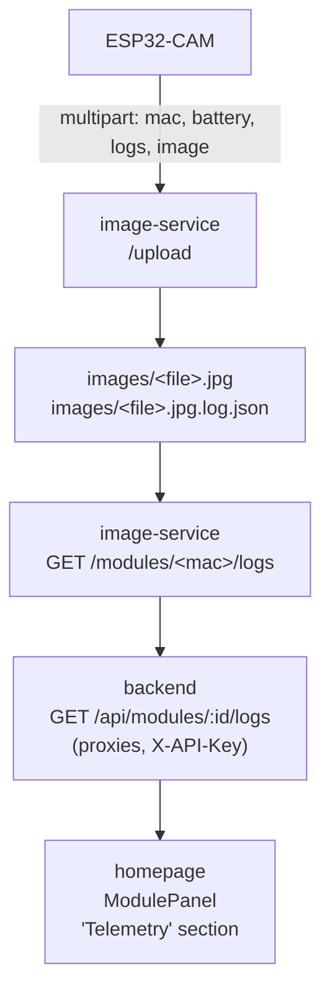

# ESP32-CAM Reliability & Telemetry

This document describes the reliability strategy, the heartbeat
telemetry channel, and the admin log-viewing flow.

The base architecture was introduced in **v1.0.0** and hardened by
PR 17 (firmware names `bumblebee`/`honeybee`/`mason`/`carpenter` —
see [ADR-006](../09-architecture-decisions/adr-006-bee-name-firmware-versioning.md)).
The end-state is captured in
[ADR-007](../09-architecture-decisions/adr-007-esp-reliability-breaker-and-daily-reboot.md):
**every failure path eventually reboots the device**, with state
preserved in NVS so the next boot can act on it.

---

## Motivation

An earlier firmware revision ran for 8–10 days and then went silent in the field. The root cause was never proven because no diagnostics existed outside the Serial Monitor. v1.0.0 fixes the most likely culprits and adds just enough telemetry to diagnose future failures after the fact.

---

## Reliability layers

The firmware has six independent safety nets, each handling a
different failure mode.

### 1. WiFi watchdog

[ESP32-CAM/esp_init.cpp](../../ESP32-CAM/esp_init.cpp) — `reconnectWifi()`

At the top of `loop()`, firmware checks `WiFi.status()`. If
disconnected it tries to reconnect for up to 15 seconds. If five
consecutive reconnect attempts fail (~1 minute), the device reboots.

Covers: router reboots, DHCP lease expiry, AP channel changes.

### 2. Task watchdog

Initialised in `setup()` via `esp_task_wdt_init(TASK_WDT_TIMEOUT_S,
true)` and `esp_task_wdt_add(NULL)`. Reset at the top of `loop()`
**and** before the long `delay(30000)` at the end of each iteration
so the long sleep starts fresh. Any hang longer than
`TASK_WDT_TIMEOUT_S` triggers a reboot with `reset_reason = TASK_WDT`.

`TASK_WDT_TIMEOUT_S` is **60 s** as of PR 17 — bumped from 30 s
because the worst-case `captureAndUpload` (3 retries × 2 s + JPEG
encode + HTTP) plus heartbeat (5 s connect timeout) could exceed
30 s and silently reboot mid-upload. See the lessons register
entry in [`docs/11-risks-and-technical-debt/`](../11-risks-and-technical-debt/README.md)
("Three PR-17 review criticals").

Covers: stuck sockets in `client.readStringUntil`, camera driver
hangs, any other deadlock.

### 3. Consecutive-failure circuit breaker (new in PR 17)

`captureAndUpload` in [`ESP32-CAM/ESP32-CAM.ino`](../../ESP32-CAM/ESP32-CAM.ino)
keeps a `static uint8_t consecutiveFailures` counter of consecutive
**upload-path** failures of any kind — camera NULL, network
start-error, send-failure, HTTP non-2xx. The counter resets to 0 on a
successful upload and increments on any other outcome. At >= 5 it
runs `delay(1000); ESP.restart()` **immediately** from inside the
upload routine.

A separate behaviour, often confused with the breaker: a single failed
first-capture-on-boot returns `false` from `captureAndUpload`, the
caller proceeds, and the next `loop()` iteration (~30 s later) tries
again. That **retry** is deferred; the **restart** is not. The
distinction is described in the comment block at the top of
`captureAndUpload` itself — read the function rather than this doc
if a future change tempts you to reorder it.

`sendHeartbeat` was hardened in PR-17 review (commit `ea7dc73`):
it parses the HTTP status line and returns 0 only on 2xx, and on any
non-2xx (or WiFi-down / connect-fail) it writes to the logbuf ring via
`logbufNoteHttpCode` (inside `sendHeartbeat` in [`ESP32-CAM/client.cpp`](../../ESP32-CAM/client.cpp)).
That gives admin telemetry a record of heartbeat failures. The
heartbeat status code is **not** wired to `consecutiveFailures` — the
breaker only counts upload failures. See
[ADR-007](../09-architecture-decisions/adr-007-esp-reliability-breaker-and-daily-reboot.md)
for the full rationale.

### 4. Daily reboot (with capture-skip)

After 24 hours of uptime the module restarts itself. Before
`ESP.restart()`, the daily-reboot path in `loop()` sets NVS
namespace `"boot"` key `daily_reboot=true`. On boot, `setup()` reads
and clears the same flag (in the same `Preferences` block) and, when
set, **skips** the first `captureAndUpload` so the daily reboot
doesn't double the daily image cost. Both sites live in
[`ESP32-CAM/ESP32-CAM.ino`](../../ESP32-CAM/ESP32-CAM.ino) — grep for
`daily_reboot`.

Clears heap fragmentation, stale TCP state, anything else that
degrades over time.

### 5. Camera recovery via PWDN cycle (new in PR 17)

When `esp_camera_fb_get()` returns NULL, `captureAndUpload` does
not just retry — it cycles the PWDN pin, calls `esp_camera_deinit()`
and `esp_camera_init()` again, then retries. Recovers the module
from sensor lock-ups that previously required a power cycle.

### 6. Boot-time recovery

- `initEspCamera()` no longer has a `while(true)` hard-lock on
  camera init failure. It now calls `ESP.restart()` after logging
  the error.
- `setupWifiConnection()` now has a 30-second initial-connect
  timeout that also triggers a restart.

Together these ensure no failure mode can leave the device stuck
indefinitely.

### 7. WiFi-fail AP fallback

[ESP32-CAM/esp_init.cpp](../../ESP32-CAM/esp_init.cpp) — `getWifiFailCount` /
`setWifiFailCount`. The threshold and the NVS key/namespace are
defined in [`ESP32-CAM/esp_init.h`](../../ESP32-CAM/esp_init.h)
alongside the helpers (`WIFI_FAIL_AP_FALLBACK_THRESH = 3`, NVS key
`"wifi_fails"` in namespace `"config"`).

When a STA-mode WiFi.begin times out (the 30-second wall in section 6),
the firmware bumps an NVS-backed counter before rebooting. On each
subsequent boot, when the device is already configured, the counter is
read at the top of `setup()` — inside the `else` of the
`isESPConfigured()` check, before `loadConfig` and `setupWifiConnection`
([`ESP32-CAM/ESP32-CAM.ino`](../../ESP32-CAM/ESP32-CAM.ino)). If it has
reached the threshold, the firmware clears the configured flag, resets
the counter, and reboots into the captive portal. A successful WiFi
join clears the counter, so a single transient outage doesn't drop the
user back into configuration.

Three failures × ~30 s ≈ 90 s before the portal returns. Designed for
the most common onboarding mistake (mistyped WiFi password) without
forcing the user through a 5-second CONFIG-button hold.

### LED legend

The on-board LED (GPIO 4) is the **camera flash** — bright enough to
light a small room. The pattern logic in
[`lib/led_state/`](../../ESP32-CAM/lib/led_state/) is therefore
deliberately minimal: every pattern fires briefly and then stays
silent. Steady-state modes (powered, connected, captive-portal-up,
trying-to-join) emit no LED at all. The Arduino-side wrapper lives in
[`led.cpp`](../../ESP32-CAM/led.cpp).

| Pattern                                      | Meaning                                                                                       |
| -------------------------------------------- | --------------------------------------------------------------------------------------------- |
| Off (default)                                | Anything that isn't an active failure or an upload — including AP mode, Connecting, Connected |
| Three 50 ms pulses (~450 ms total), then off | WiFi join timed out (~1 s LED hold before reboot)                                             |
| Single 50 ms pulse, then off                 | Capture+upload starting (one pulse per capture)                                               |

If you need to confirm the board is alive in steady state, use the
phone WiFi list (AP mode), the serial monitor, or the dashboard
(connected). The LED is a signal channel for failures and uploads,
not a presence indicator.

---

## Telemetry

The ESP piggybacks a JSON telemetry payload onto every image upload as an additional multipart form field called `logs`. The image-service stores it as a sidecar file next to the image. The admin UI fetches it via the backend.

### Payload format

```json
{
  "fw": "1.0.0",
  "uptime_s": 72145,
  "last_reset_reason": "TASK_WDT",
  "free_heap": 124352,
  "min_free_heap": 98211,
  "rssi": -67,
  "wifi_reconnects": 2,
  "last_http_codes": [200, 200, 500, 200, 200],
  "log": "[BOOT] fw=1.0.0 reset_reason=1 boot_count=3\n[WIFI] disconnected — attempting reconnect\n..."
}
```

| Field               | Source                                                         | Meaning                                                                                                                                                                                                                                                                                                                                        |
| ------------------- | -------------------------------------------------------------- | ---------------------------------------------------------------------------------------------------------------------------------------------------------------------------------------------------------------------------------------------------------------------------------------------------------------------------------------------- |
| `fw`                | `FIRMWARE_VERSION` macro in `esp_init.h` (currently `"1.0.0"`) | Firmware version string. ⚠️ Distinct from the `fw_version` field in the heartbeat body, which uses the `FW_VERSION` macro in `client.cpp` (`"honeybee"`), and from `ESP32-CAM/VERSION` (`"carpenter"`) consumed by `build.sh`. See [ADR-006](../09-architecture-decisions/adr-006-bee-name-firmware-versioning.md) for the unification status. |
| `uptime_s`          | `millis()/1000`                                                | Seconds since last boot                                                                                                                                                                                                                                                                                                                        |
| `last_reset_reason` | `esp_reset_reason()`                                           | `POWERON`, `BROWNOUT`, `TASK_WDT`, `PANIC`, etc.                                                                                                                                                                                                                                                                                               |
| `free_heap`         | `ESP.getFreeHeap()`                                            | Current free heap in bytes                                                                                                                                                                                                                                                                                                                     |
| `min_free_heap`     | `ESP.getMinFreeHeap()`                                         | Low-water mark over this boot session                                                                                                                                                                                                                                                                                                          |
| `rssi`              | `WiFi.RSSI()`                                                  | WiFi signal strength in dBm                                                                                                                                                                                                                                                                                                                    |
| `wifi_reconnects`   | logbuf counter                                                 | Count of `reconnectWifi()` fires since boot                                                                                                                                                                                                                                                                                                    |
| `last_http_codes`   | logbuf ring                                                    | Last 8 HTTP status codes from `postImage()`                                                                                                                                                                                                                                                                                                    |
| `log`               | logbuf ring                                                    | Last ~2 KB of `logf()` output, oldest→newest                                                                                                                                                                                                                                                                                                   |

### Circular log buffer

[ESP32-CAM/logbuf.cpp](../../ESP32-CAM/logbuf.cpp) — `logf(fmt, ...)`

A fixed 2 KB ring buffer. `logf()` works like `Serial.printf()` but also appends to the ring. Only events worth sending home go through `logf()`; noisy per-frame traces keep using `Serial.print*`. When the ring wraps, `buildTelemetryJson()` serializes it oldest→newest.

No heap allocation per entry, no dynamic growth — safe to call from anywhere including error paths.

---

## Data flow



1. ESP uploads an image. The `logs` part is parsed and written to `{image_path}.log.json`.
2. `GET /modules/<mac>/logs?limit=N` (image-service) globs `*.log.json`, filters by `_mac`, sorts by mtime, returns the newest N entries.
3. `GET /api/modules/:id/logs` (backend) proxies the above behind the existing `X-API-Key` middleware so the frontend can use a single origin.
4. `ModulePanel.tsx` has a collapsible "Telemetry" section that lazy-loads logs when opened.

### Sidecar file contents

Each `.log.json` is the raw telemetry payload plus three fields added by the image-service:

```json
{
  "...telemetry fields...": "...",
  "_mac": "12345678901234",
  "_received_at": "2026-04-11T14:32:17",
  "_image": "esp_capture_20260411_143217.jpg"
}
```

If the ESP ever sends non-JSON, the sidecar still gets written as `{"raw": "...", "parse_error": true, "_mac": ..., ...}` so the admin view can always show _something_.

---

## Reading logs from the admin view

The Telemetry section is **admin-only** and hidden from the normal dashboard. To unlock it:

1. Open the dashboard with `?admin=1` in the URL, e.g. `https://highfive.example.com/dashboard?admin=1`.
2. The admin flag is stored in `sessionStorage` under `hf_admin` and survives navigation within the tab; closing the tab clears it.
3. Click a module pin on the map.
4. In the right-hand **Module Details** panel, expand the **Telemetry** section.
5. The last ten uploads are shown newest-first, with uptime, free heap, WiFi RSSI, last reset reason, WiFi reconnect count, and the last eight HTTP response codes.
6. Expand the **log** dropdown on any entry to see the raw circular-buffer contents from that boot session.

Reading the telemetry is a good first stop whenever a module looks unhealthy: a spike in `wifi_reconnects`, a low `min_free_heap`, or non-2xx `last_http_codes` will usually point at the problem immediately.

### Admin key (backend gate)

On top of the `?admin=1` UI flag, the `GET /api/modules/:id/logs` endpoint requires an `X-Admin-Key` header matching the existing `HIGHFIVE_API_KEY`. This is the same key used by all `/api` routes, but regular dashboard pages send it automatically (via the bundled `VITE_API_KEY`). The admin endpoint demands it be provided _explicitly_ as `X-Admin-Key` — casual visitors who just open the dashboard will never trigger that header.

**Frontend UX:** the admin key is **not** sent automatically. The first
time a user opens the Telemetry section in a tab, the page renders an
inline `AdminKeyForm` (React component, replaced the legacy
`window.prompt()` flow in PR 17 commit `5b110de`) and stores the
submitted key in `sessionStorage['hf_admin_key']` (cleared on tab
close). If the backend returns 403, the stored key is cleared and the
form is re-shown. No extra env vars needed — you reuse the
`HIGHFIVE_API_KEY` you already have.

The same `AdminPage` is the admin telemetry table at `/admin?admin=1`
with the per-module heartbeat snapshot (`HeartbeatSnapshot`,
[ADR-004](../09-architecture-decisions/adr-004-heartbeat-snapshot-in-contracts.md)),
the image inspector, and the Discord webhook test surface.

**Scope:** this gate only affects `GET /api/modules/:id/logs`. ESPs post images to `image-service:/upload` directly and are completely unaffected — the upload path has no admin requirement.

---

## Out of scope for v1.0.0

- Refactoring the hot `postImage()` path away from `String` concatenation. The daily reboot + heap telemetry mitigate the fragmentation risk without touching delicate code. Revisit if telemetry shows `min_free_heap` dropping over time.
- Central log database or alerting. Sidecar files on the image-service are enough for a single-operator setup.
- OTA firmware update.
