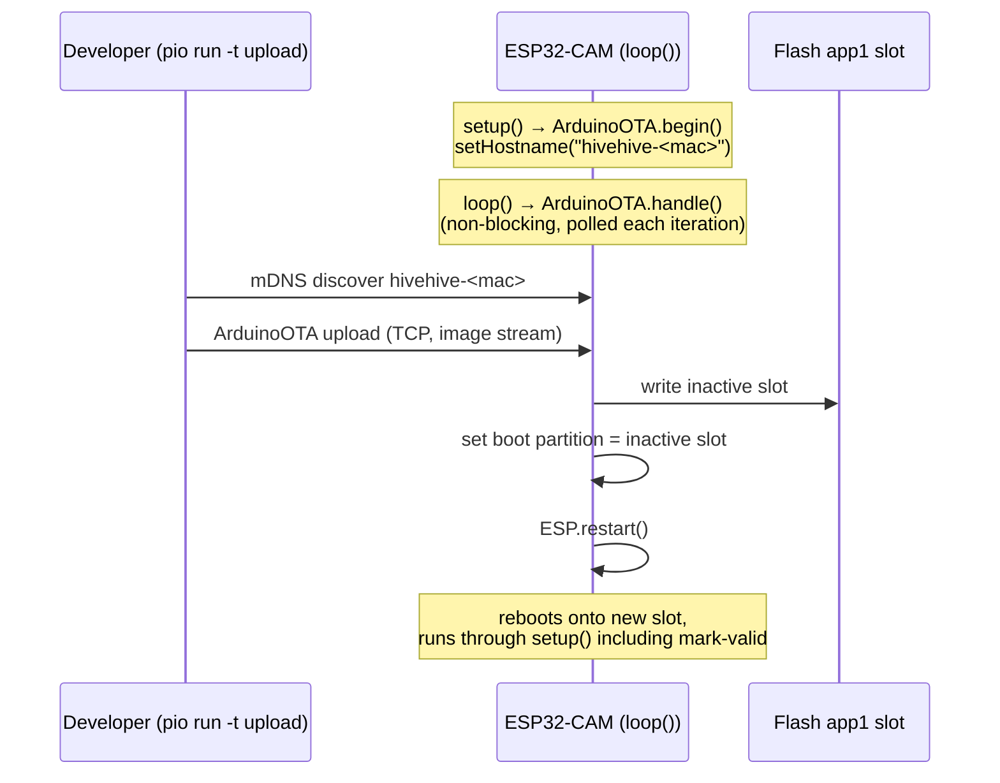
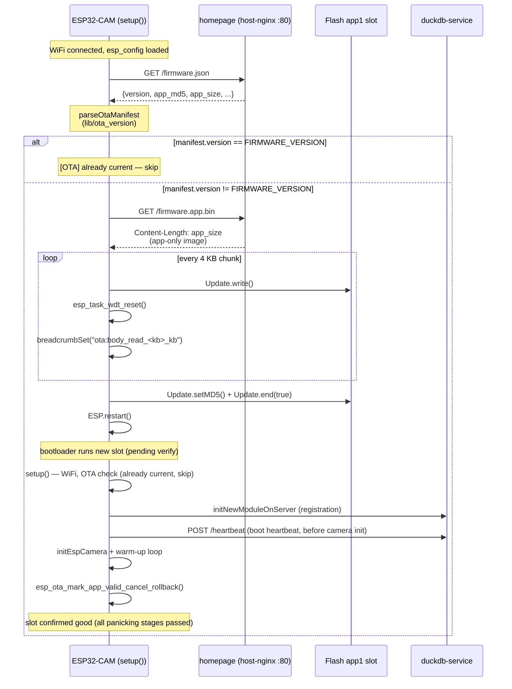

# OTA update flow

Two paths reach a deployed module's flash without a USB cable.
[ADR-008](../09-architecture-decisions/adr-008-firmware-ota-partition-and-rollback.md)
records the design.

## Phase 1 — LAN push (ArduinoOTA)

The developer's PlatformIO speaks ArduinoOTA's mDNS-discoverable
protocol over the local network. The module advertises itself as
`hivehive-<12hex-module-id>` so `pio device list` distinguishes
modules on the same LAN.

The 30 s `delay(30000)` at the bottom of `loop()` caps the time
between an upload request and the next `ArduinoOTA.handle()` poll.
PlatformIO retries the connect for ~60 s by default, so this is fine
in practice.

## Phase 2 — boot-time HTTP pull

On every boot — including the daily reboot from ADR-007 — the
firmware fetches `homepage/public/firmware.json`, compares the
manifest's `version` to compiled-in `FIRMWARE_VERSION`, and pulls a
new app-only binary if they differ.

## Rollback

Rollback is **app-initiated**, not ROM-bootloader-initiated. Arduino-
ESP32's prebuilt bootloader ships with
`CONFIG_BOOTLOADER_APP_ROLLBACK_ENABLE=n`, so the ROM does not
transition slots out of `ESP_OTA_IMG_NEW` on panic and does not
auto-revert on the next reset — a bad slot would otherwise reboot
forever. Verified empirically during manual T4 of #26 (see
[`docs/10-quality-requirements/manual-tests-ota.md`](../10-quality-requirements/manual-tests-ota.md)).

`ESP32-CAM/ESP32-CAM.ino`'s `forceRollbackIfPendingTooLong`, called
near the top of `setup()`, owns the recovery. Its decision logic is the
pure, native-tested state machine in
[`ESP32-CAM/lib/ota_rollback`](../../ESP32-CAM/lib/ota_rollback/ota_rollback.h);
the function is just NVS + `esp_ota` glue. There are **two** rollback triggers:

1. **Faulty-boot loop (#26).** On any boot whose previous run died via
   panic/WDT/brownout (gated by `esp_reset_reason()`), it increments
   `Preferences("ota").pv_boots`. At `HF_OTA_MAX_PENDING_BOOTS = 3` it calls
   `esp_ota_mark_app_invalid_rollback_and_reboot()`. Clean reboots (POWERON, SW
   from AP-fallback, daily reboot, liveness/WiFi-health recovery, OTA
   post-flash) do not increment, so transient WiFi flakes that trip
   `WIFI_FAIL_AP_FALLBACK_THRESH` do not also trip rollback.
2. **No-contact loop (#148 Phase 3).** A slot flashed by OTA boots with
   `Preferences("ota").unproven = 1` (set by `ota.cpp` before the post-flash
   reboot — the only site that sets it). Such a slot validates only on its
   first **server contact** (2xx heartbeat/upload), which marks the app valid
   and clears `unproven`; merely surviving `setup()` no longer validates it.
   Each unproven boot that fails to make contact increments `nc_boots`; at
   `HF_OTA_MAX_NOCONTACT_BOOTS = 3` the slot is reverted. Because the liveness
   watchdog reboots a mute slot every ~2 h, this catches a "boots-clean-but-
   can't-reach-the-server" image (~6–8 h) that the faulty-boot trigger misses.

A **proven/factory slot** (`unproven = 0` — never OTA'd, or already validated)
is immune to trigger 2: a multi-hour server/Wi-Fi outage never rolls back good
firmware. Full reasoning + invariants live in
[`docs/09-architecture-decisions/adr-008-firmware-ota-partition-and-rollback.md`](../09-architecture-decisions/adr-008-firmware-ota-partition-and-rollback.md)
(see the mark-valid-on-first-contact addendum).

Since #148 Phase 3, the `esp_ota_mark_app_valid_cancel_rollback()` IDF call
**still fires only at end-of-`setup()`** (after camera init — see the "earned
stage placement" rule below), but it is now **gated on the slot being proven**.
The first 2xx boot/loop heartbeat clears the `unproven` flag (it does *not*
mark-valid early — that would be permanent and would defeat the camera-panic
rollback); the end-of-`setup()` block then marks valid for any proven slot. A
new-`fwVersion` heartbeat appears on the server (and the dashboard's
**Firmware** pill — see `homepage/src/components/ModulePanel.tsx`) at first
contact, slightly before the slot is formally marked valid. Two failure modes,
two triggers:

- **Reaches the server, then panics in a later setup stage** (e.g.
  `initEspCamera`): the panic loop reboots before end-of-`setup()`, so
  mark-valid never fires and the slot stays revert-eligible — `pv_boots`
  accumulates and reverts it at ~3 cycles, exactly as in the original #26
  design. Clearing `unproven` at first contact does not undermine this.
- **Cannot reach the server at all**: never clears `unproven`, so the
  no-contact trigger (`nc_boots`) reverts it.

Operator-observable: a bricked OTA shows up on the dashboard as a module whose
**Firmware** pill reverts to (or never leaves) the **old** bee-name, with a
breadcrumb in the next telemetry sidecar naming which stage of the new
firmware's setup() failed (e.g. `setup:initEspCamera`,
`setup:initNewModuleOnServer`, `setup:ota_mark_valid`). No manual intervention
needed — a panic-loop recovers in ~3 cycles ≈ 30–60 s; a can't-reach-server
image in ~6–8 h.

## Partition layout migration

The first OTA-capable binary has to arrive via USB or the web
installer's merged `firmware.bin` — both flash bootloader +
partitions + app together. OTA itself cannot install a new partition
table because the bootloader reads it from flash offset `0x8000`
which the OTA path does not touch. After that first flash, every
subsequent update can be OTA. See
[chapter-11 "OTA migration is one-way"](../11-risks-and-technical-debt/README.md)
for the lessons-learned entry that exists so the next person doesn't
have to relearn this.
