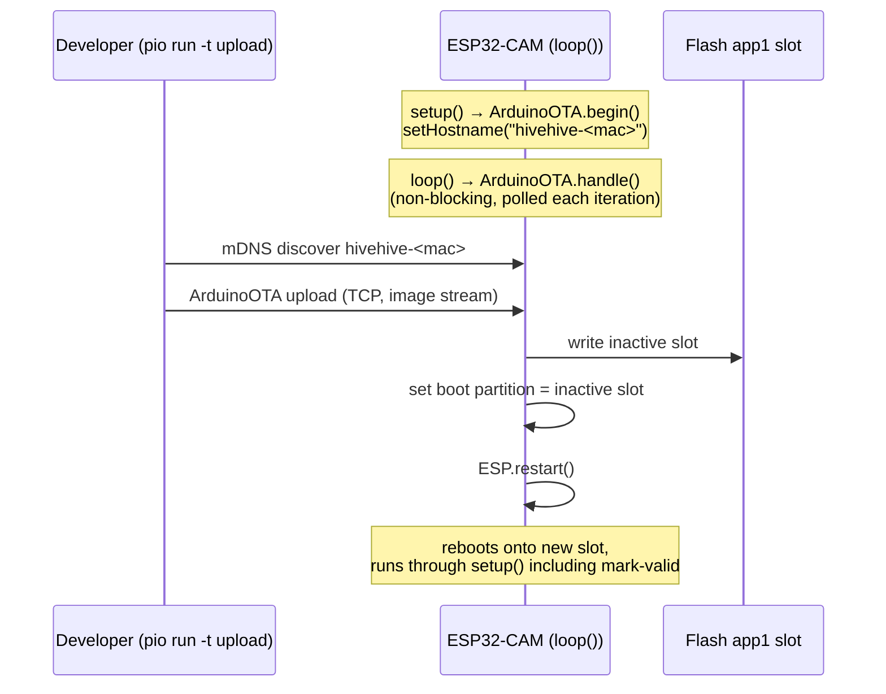
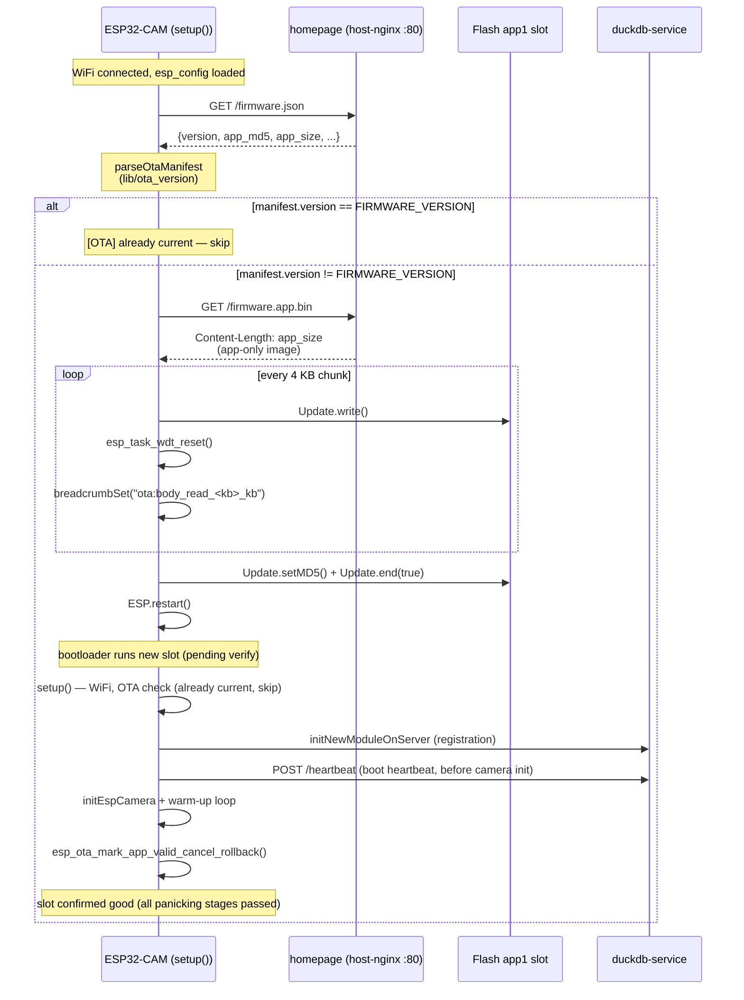

# OTA update flow

Two paths reach a deployed module's flash without a USB cable.
[ADR-008](../09-architecture-decisions/adr-008-firmware-ota-partition-and-rollback.md)
records the design.

## Phase 1 — LAN push (ArduinoOTA)

The developer's PlatformIO speaks ArduinoOTA's mDNS-discoverable
protocol over the local network. The module advertises itself as
`hivehive-<12hex-module-id>` so `pio device list` distinguishes
modules on the same LAN.

The 30 s `delay(30000)` at the bottom of `loop()` caps the time
between an upload request and the next `ArduinoOTA.handle()` poll.
PlatformIO retries the connect for ~60 s by default, so this is fine
in practice.

## Phase 2 — boot-time HTTP pull

On every boot — including the daily reboot from ADR-007 — the
firmware fetches `homepage/public/firmware.json`, compares the
manifest's `version` to compiled-in `FIRMWARE_VERSION`, and pulls a
new app-only binary if they differ.

## Rollback

ESP32 OTA partitions are managed by the ROM bootloader. A freshly-
flashed slot enters `ESP_OTA_IMG_NEW` state and the bootloader runs
it exactly once. If the firmware reaches the
`esp_ota_mark_app_valid_cancel_rollback()` call at the very end of
`setup()` — every setup stage is inside the gate — the slot
transitions to `ESP_OTA_IMG_VALID`. If the firmware crashes,
watchdog-fires, or panics before reaching the gate, the bootloader
reverts to the previous `ESP_OTA_IMG_VALID` slot on the next reset.

The boot heartbeat
fires before mark-valid, so a new-`fwVersion` heartbeat may briefly
appear on the server while the slot is still pending verify. If
camera init then panics and the slot rolls back, the next boot's
heartbeat will correct the reported version. This brief flicker is
intentional — planting the heartbeat early keeps the "boot latency →
dashboard refresh" benefit described in the image-upload-flow doc.

Operator-observable: a bricked OTA shows up on the dashboard as a
module that keeps reporting the **old** `fwVersion` in its
`latestHeartbeat` panel (the flicker corrects itself), with a
breadcrumb in the next telemetry sidecar naming which stage of the
new firmware's setup() failed
(e.g. `setup:initEspCamera`, `setup:initNewModuleOnServer`).
No manual intervention needed — the unit recovers on its own.

## Partition layout migration

The first OTA-capable binary has to arrive via USB or the web
installer's merged `firmware.bin` — both flash bootloader +
partitions + app together. OTA itself cannot install a new partition
table because the bootloader reads it from flash offset `0x8000`
which the OTA path does not touch. After that first flash, every
subsequent update can be OTA. See
[chapter-11 "OTA migration is one-way"](../11-risks-and-technical-debt/README.md)
for the lessons-learned entry that exists so the next person doesn't
have to relearn this.
