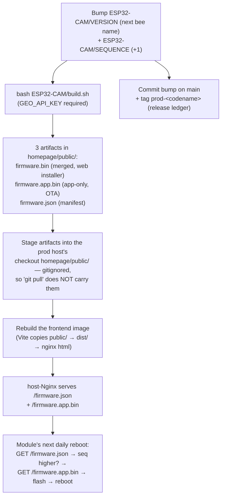

# Cutting a firmware OTA release

The end-to-end procedure for shipping a new ESP32-CAM firmware to the
deployed fleet over the air. This is the **operator runbook**; the
runtime mechanics live in
[../06-runtime-view/ota-update-flow.md](../06-runtime-view/ota-update-flow.md)
and the design rationale in
[../09-architecture-decisions/adr-008-firmware-ota-partition-and-rollback.md](../09-architecture-decisions/adr-008-firmware-ota-partition-and-rollback.md).

## The one rule

**Bump `ESP32-CAM/SEQUENCE`, or the fleet never pulls your release.**

A module flashes itself only when the published manifest's `sequence`
is **strictly greater** than the sequence baked into the running
binary (see [the comparator](#how-a-module-decides-to-flash)). Merging
firmware _source_ to `main` changes nothing on the field: until a build
with a higher `SEQUENCE` is published, every module keeps running what
it has. Bumping `VERSION` (the bee-name label) alone is **not** enough —
the label differing is necessary but not sufficient. This silent no-op
has shipped twice; see
[chapter 11 → "Merging firmware source is not a release"](../11-risks-and-technical-debt/README.md#merging-firmware-source-is-not-a-release--the-sequence-bump-is-the-release-150-132).

## Mental model



## Release checklist

The numbered actions. Steps 1, 2, 5 happen in your local clone; steps
3–4 and 6 touch the prod host and the live fleet.

0. **Pre-flight.** Be on a clean `main` (`git switch main && git pull`).
   Have the Google Geolocation key available — either `export
GEO_API_KEY=...` or the gitignored `ESP32-CAM/GEO_API_KEY` file. A
   keyless build is **fatal by default** (it would ship `(0,0,0)`
   modules that never appear on the map — see
   [build.sh](../../ESP32-CAM/build.sh)'s `GeoKey` block and the
   chapter-11 "keyless release" lesson).

1. **Bump both version files.** This is the release itself:
   - `ESP32-CAM/VERSION` → a bee-species codename that has **never been
     used before** — not merely different from the currently-deployed
     release ([ADR-006](../09-architecture-decisions/adr-006-bee-name-firmware-versioning.md)).
     The comparator skips any module whose running `version` _string
     equals_ the manifest's, so reusing an old codename strands every
     straggler still on it (see the chapter-11 `digger`→`squash`
     codename-collision lesson). Cross-check against **both** namespaces
     before picking: `git log --oneline -- ESP32-CAM/VERSION` (past
     firmware codenames) and `git tag -l 'prod-*'` (past deploy tags).
   - `ESP32-CAM/SEQUENCE` → the current integer **+ 1** (the actual OTA
     gate; monotonic, never reused, never decremented).

2. **Build.** From the repo root, in Git Bash / bash:

   ```bash
   cd ESP32-CAM && bash build.sh
   ```

   `build.sh` compiles with `-DFIRMWARE_VERSION` / `-DFIRMWARE_SEQUENCE`
   injected, stitches the merged web-installer image, and writes all
   three artifacts into `homepage/public/` plus the `firmware.json`
   manifest ([build.sh](../../ESP32-CAM/build.sh)). It runs on Windows
   11 + Git Bash unchanged (#99). **Read the final lines** — confirm the
   printed `version`, `sequence`, and `app_md5`; note `app_md5` for the
   tag in step 5. `build.sh` warns on stderr if `SEQUENCE` is **lower**
   than the previously-published manifest (an accidental downgrade).

   **Bench-verify PSRAM before publishing (#163).** `build.sh` is the
   release path, and a build-config regression (a wrong `memory_type`, or a
   dropped `-DBOARD_HAS_PSRAM`) makes the binary boot with PSRAM off and
   upload degraded VGA/DRAM images with nothing failing loudly. `build.sh`
   now greps its verbose `build/compile.log` and aborts unless **both**
   `-DBOARD_HAS_PSRAM` reached g++ **and** the `dio_qspi` libs were linked —
   but those guards are necessary, not sufficient: only flashing the release
   binary and reading `-- PSRAM: found=1` over serial proves it (restoring
   the define alone did **not** fix `found=0` in #163). So flash the
   just-built merged image to **one** bench module and confirm. In
   PowerShell, with the board on `COM9`:

   ```powershell
   python -m esptool --chip esp32 --port COM9 write_flash 0x0 ESP32-CAM/build/ESP32-CAM.ino.merged.bin
   ```

   > If `python -m esptool` errors with `module 'esptool' has no attribute
'_main'` (a mismatched pip `esptool` shadowing the vendored one — the
   > same trap `build.sh` guards against), flash with the bundled binary
   > instead: `& "$env:LOCALAPPDATA\Arduino15\packages\esp32\tools\esptool_py\*\esptool.exe" --chip esp32 --port COM9 write_flash 0x0 ESP32-CAM/build/ESP32-CAM.ino.merged.bin`.

   The `-- PSRAM:` line is printed by `initEspCamera`, which runs **only
   after the module is configured and joined to Wi-Fi** — and flashing the
   full merged image at `0x0` wipes the NVS `configured` flag, so a
   freshly-flashed module boots into AP mode (`ESP32-Access-Point`,
   http://192.168.4.1) and never reaches camera init. **Onboard it via the
   AP first** (see [esp-flashing.md](esp-flashing.md)), then capture:

   ```powershell
   python scripts/esp_capture.py COM9 60          # after onboarding; expect "-- PSRAM: found=1"
   python scripts/esp_reset.py COM9; python scripts/esp_capture.py COM9 60   # repeat a couple of boots
   ```

   If any boot reports `found=0`, **do not publish** — rebuild and re-verify
   (see [risks ch. 11 → "`build.sh` release binaries ran without PSRAM"](../11-risks-and-technical-debt/README.md#lessons-learned)).

3. **Publish the artifacts to prod.** The three files are **gitignored
   build outputs** (the `*.bin` glob and the explicit
   `homepage/public/firmware.json` line in [.gitignore](../../.gitignore)),
   so a `git pull` on the prod host does **not** carry them. With the
   committed topology they are baked into the **frontend container** at
   image-build time (Vite copies `homepage/public/*` → `dist/`, which
   [homepage/Dockerfile](../../homepage/Dockerfile) serves as the nginx
   html root; the container has no bind-mount). So publishing means: get
   the three files into the prod host's checkout `homepage/public/`, then
   **rebuild the frontend image**:

   ```bash
   # On the prod host, with the new firmware.{bin,app.bin,json} staged
   # into homepage/public/ (scp them from your local build, or run
   # build.sh on the host if the arduino-cli toolchain is installed there):
   docker compose -f docker-compose.prod.yml up -d --build frontend
   ```

   > **Verify this transport against your live prod host before relying
   > on it.** The step is _derived from the committed topology_
   > (host-Nginx → frontend container; `public/` baked into the image; no
   > bind-mount) — it is **not** confirmed against how the last release
   > (`woolcarder`) actually shipped, because the binaries are published
   > out-of-band and are not in git. Confirm two things on the host: (1)
   > `/firmware.json` is really served by the frontend container — the
   > documented host-Nginx `location =` blocks proxy it to
   > `127.0.0.1:8081`, not a host static path
   > ([production-deployment.md → OTA firmware artifacts](production-deployment.md));
   > and (2) you are rebuilding the checkout your services actually deploy
   > from, which is itself unsettled (see
   > [Git: branch & tag model](#git-branch--tag-model)). **If (1) is
   > false** — `public/` is served from a host static path or a bind-mount
   > rather than baked into the image — then the publish _action_ changes:
   > drop the three files at that path directly, with **no** image
   > rebuild. No Nginx change is needed per release.

4. **Verify it is served.** From anywhere:

   ```bash
   curl.exe -s https://highfive.schutera.com/firmware.json
   ```

   Confirm `version` and `sequence` match what you just built, and that
   `app_md5` matches step 2's output (the binary the fleet will fetch).

5. **Record the release in git.** Commit the `VERSION` / `SEQUENCE` bump
   to `main`, then tag it:

   ```bash
   git add ESP32-CAM/VERSION ESP32-CAM/SEQUENCE
   git commit -m "chore(esp): bump firmware to <codename> / sequence <N> — <why>"
   git tag -a prod-<codename> -m "deploy: firmware OTA <codename> / sequence <N> (app_md5 <...>). <go-ahead / bench-test / rollback status>."
   git push origin main --follow-tags
   ```

   The annotated `prod-<codename>` tag is the **release ledger** — the
   human record of "this commit's VERSION/SEQUENCE was built and
   published to the OTA server." The binaries are not in git, so the
   `app_md5` in the tag note is what pins the release to a specific
   build. See [Git: branch & tag model](#git-branch--tag-model).

6. **Confirm the fleet picks it up.** Modules check `/firmware.json` on
   **every boot, including the daily reboot** ([ADR-007](../09-architecture-decisions/adr-007-esp-reliability-breaker-and-daily-reboot.md)),
   so the whole fleet converges within ≤ 24 h with no further action.
   Watch the dashboard's **Firmware** pill / `latestHeartbeat.fwVersion`
   flip to the new codename, or poll:
   ```bash
   curl.exe -s https://highfive.schutera.com/api/modules
   ```
   A module whose pill never advances may be un-migrated (needs a
   one-time USB flash — see
   [esp-flashing.md → First-time OTA migration](esp-flashing.md#first-time-ota-migration-one-way-usb-only)),
   or it OTA-flashed and rolled back (a setup-stage panic — the next
   telemetry sidecar names the failing stage; see [Rollback](#rollback)).

## How a module decides to flash

The on-device comparator
([`shouldOtaUpdate`](../../ESP32-CAM/lib/ota_version/ota_version.h)) returns
true **iff**:

> `manifest.version != my_version` **AND** `my_sequence != 0` **AND**
> (`manifest.sequence > my_sequence` **OR** `manifest.allow_downgrade == true`)

- The **sequence** is the real lever, but `manifest.version != my_version`
  is a hard **AND** condition, not a formality: a module whose running
  codename equals the manifest's is skipped _regardless of sequence_.
  "Differ" therefore means differ from **every codename still alive in
  the field** — including stale stragglers on a codename older than the
  currently-deployed release — not just from the last release. Never
  reuse a codename. This is why step 1 bumps _both_ files to fresh
  values.
- `my_sequence != 0` is the **dev escape hatch**: an Arduino-IDE build
  that bypasses `build.sh` compiles with `FIRMWARE_SEQUENCE = 0` and
  refuses to auto-flash itself onto a fleet release.
- `allow_downgrade` is the deliberate-rollback override (default
  `false`). Full semantics:
  [ADR-008 → Sequence + allow_downgrade addendum](../09-architecture-decisions/adr-008-firmware-ota-partition-and-rollback.md#sequence--allow_downgrade-addendum-pr-ii-83).

## Git: branch & tag model

Two deployment tracks share the repo and are easy to conflate:

| Track                                                                  | Source of truth                                                                                      | "Deploy" action                                                                                      |
| ---------------------------------------------------------------------- | ---------------------------------------------------------------------------------------------------- | ---------------------------------------------------------------------------------------------------- |
| **Firmware OTA** (this doc)                                            | `ESP32-CAM/VERSION` + `ESP32-CAM/SEQUENCE` on **`main`**, marked by `prod-<codename>` annotated tags | `build.sh` → stage artifacts → rebuild frontend image. **Does not involve the `production` branch.** |
| **Web services** (backend / frontend / image-service / duckdb-service) | the **`production` branch** per [production-deployment.md](production-deployment.md)                 | `git pull` on the host → `docker compose -f docker-compose.prod.yml up -d --build`                   |

Firmware releases are cut on `main` and pinned by `prod-*` tags; the
binaries themselves are gitignored and pinned by `app_md5` in the tag
note. The `production` branch is a **separate** concern (the Docker
services) and the firmware OTA path never touches it.

> **Known drift (verify before relying on it).** `origin/production` is
> currently far behind `main`, yet the live services run `main`-only
> code (e.g. the #142 admin-session endpoints respond in prod). Whether
> services are now deployed from `main` or the `production` branch is
> stale needs operator confirmation — see
> [chapter 11 → "`production` branch drifted from the deployed services"](../11-risks-and-technical-debt/README.md#production-branch-drifted-from-the-deployed-services-undocumented-deploy-source).

## Rollback

A fleet rollback is a deliberate, sequenced operation — you cannot just
lower `SEQUENCE` (the comparator refuses it). Set `allow_downgrade:
true` for one publish, then un-set it on the next regular release.
Step-by-step:
[esp-flashing.md → How to deliberately roll back a fleet](esp-flashing.md#how-to-deliberately-roll-back-a-fleet-pr-ii--issue-83).
Note that a bricked OTA self-recovers without a rollback publish — the
app-side counter reverts to the previous slot after 3 faulty boots
([ADR-008 rollback](../09-architecture-decisions/adr-008-firmware-ota-partition-and-rollback.md)).

## Ground truth — where each piece is defined

| Piece                                        | Authoritative source                                                                                                                                                                                                          |
| -------------------------------------------- | ----------------------------------------------------------------------------------------------------------------------------------------------------------------------------------------------------------------------------- |
| Version label scheme (bee names)             | [ADR-006](../09-architecture-decisions/adr-006-bee-name-firmware-versioning.md)                                                                                                                                               |
| Sequence gate + `allow_downgrade` comparator | [ADR-008 addendum](../09-architecture-decisions/adr-008-firmware-ota-partition-and-rollback.md#sequence--allow_downgrade-addendum-pr-ii-83), [`lib/ota_version/ota_version.h`](../../ESP32-CAM/lib/ota_version/ota_version.h) |
| Build + 3-artifact publish + manifest fields | [`ESP32-CAM/build.sh`](../../ESP32-CAM/build.sh), [ADR-008 decision §3](../09-architecture-decisions/adr-008-firmware-ota-partition-and-rollback.md)                                                                          |
| Runtime fetch / flash sequence               | [ota-update-flow.md](../06-runtime-view/ota-update-flow.md), [`ESP32-CAM/ota.cpp`](../../ESP32-CAM/ota.cpp)                                                                                                                   |
| App-side rollback (faulty-boot counter)      | [ADR-008](../09-architecture-decisions/adr-008-firmware-ota-partition-and-rollback.md), [`ESP32-CAM/ESP32-CAM.ino`](../../ESP32-CAM/ESP32-CAM.ino)'s `forceRollbackIfPendingTooLong`                                          |
| Host-Nginx serving of `/firmware.*`          | [production-deployment.md](production-deployment.md)                                                                                                                                                                          |
| First-time USB migration (one-way)           | [esp-flashing.md](esp-flashing.md#first-time-ota-migration-one-way-usb-only)                                                                                                                                                  |
| Incident: source-merge ≠ release             | [chapter 11](../11-risks-and-technical-debt/README.md#merging-firmware-source-is-not-a-release--the-sequence-bump-is-the-release-150-132)                                                                                     |
