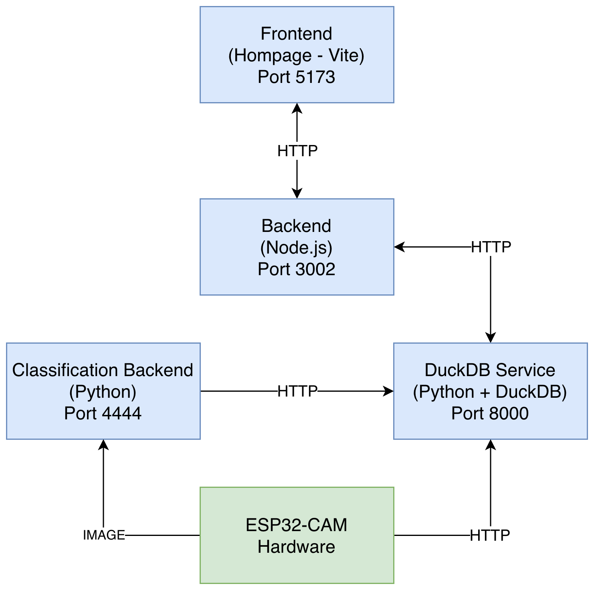
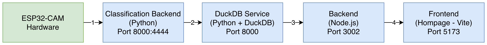

# HiveHive Architecture

For a one-page summary aimed at new contributors, see
[`/ARCHITECTURE.md`](../ARCHITECTURE.md) at the repo root. This
document is the deeper deep-dive.

## 1. System Purpose

HiveHive monitors wild-bee nesting activity with camera-enabled edge
modules (ESP32-CAM), classifies nesting images, persists progress data
in DuckDB, and visualizes module status and nest progress in a web
dashboard.

The platform follows a microservice architecture with clear
responsibility boundaries between UI, API aggregation, image ingestion,
and persistence.

## 2. Runtime Components

| Component        | Tech                           | Host port -> Container port | Responsibility                                                              |
| ---------------- | ------------------------------ | --------------------------- | --------------------------------------------------------------------------- |
| `homepage`       | React 19 + Vite + TypeScript   | `5173 -> 5173`              | Dashboard UI, map view, module detail, setup wizard, hive-module info       |
| `backend`        | Node.js + Express + TypeScript | `3002 -> 3002`              | Auth-gated API for the frontend; aggregates module / nest / progress; admin telemetry proxy |
| `image-service`  | Python + Flask                 | `8000 -> 4444`              | Image upload + telemetry sidecar; stub classifier; progress writeback       |
| `duckdb-service` | Python + Flask + DuckDB        | `8002 -> 8000`              | Persistent storage API (`modules`, `nests`, `progress`)                     |
| `ESP32-CAM`      | C++ / Arduino + PlatformIO     | n/a (edge device)           | Captures images, builds telemetry payload, uploads via multipart            |

## 3. Deployment Topology (Docker Compose)

- All four services run on a single shared Docker bridge network: `net`.
- The DuckDB file lives in volume `duckdb_data`, mounted into both
  `image-service` and `duckdb-service` at `/data`.
- Inter-service URLs use Docker service names, **not** `localhost`:
  - `backend` → `http://duckdb-service:8000`
  - `backend` → `http://image-service:4444` (admin telemetry proxy)
  - `image-service` → `http://duckdb-service:8000`

## 4. Data-flow Diagram

```
                                                 field
                                ┌──────────────────────────────┐
                                │  ESP32-CAM (firmware ≥1.0.0) │
                                │  capture every N min         │
                                │  builds {fw, uptime_s,       │
                                │   free_heap, rssi,           │
                                │   wifi_reconnects, log…}     │
                                └──────────────┬───────────────┘
                                               │ POST /upload
                                               │ multipart: image, mac,
                                               │            battery, logs
                                               ▼
                                ┌──────────────────────────────┐
                                │  image-service  (Flask)      │  :4444
                                │  • saves <file>.jpg          │
                                │  • writes <file>.jpg.log.json│
                                │  • stub classifier           │
                                │  • POST /add_progress…       │
                                │  • UPDATE module_configs     │ ← direct DB write,
                                │     (battery, image_count)   │   known issue, Phase 4
                                └────┬───────────────────┬─────┘
                                     │                   │
                          POST /add_progress_for_module  │
                                     ▼                   │
                                ┌─────────────────────────────┐
                                │  duckdb-service (Flask)     │  :8000
                                │  owns app.duckdb            │
                                │  /modules /nests /progress  │
                                │  /new_module /add_progress… │
                                │  /health                    │
                                └────────────────┬────────────┘
                                                 │ GET /modules /nests /progress
                                                 ▼
                                ┌─────────────────────────────┐
                                │  backend (Express + TS)     │  :3002
                                │  in-memory cache            │
                                │  /api/health (public)       │
                                │  /api/modules*  X-API-Key   │
                                │  /api/modules/:id/logs      │
                                │     X-API-Key + X-Admin-Key │
                                │     proxies to image-service│
                                └────────────────┬────────────┘
                                                 │ fetch + X-API-Key
                                                 ▼
                                ┌─────────────────────────────┐
                                │  homepage (React 19 + Vite) │  :5173
                                │  / /dashboard /setup        │
                                │  /hive-module /assembly     │
                                │  Telemetry UI gated ?admin=1│
                                └─────────────────────────────┘
```

## 5. Core Data Flows

### 5.1 Dashboard Read Flow

1. Browser loads `homepage`.
2. Frontend calls `backend` (`/api/modules`, `/api/modules/:id`) with `X-API-Key`.
3. `backend.ModuleCache` calls `duckdb-service`:
   - `GET /modules`, `GET /nests`, `GET /progress`
4. `backend` normalises raw rows into frontend DTOs and serves them.
5. Frontend renders the map, module list, status, battery and nest progress.

### 5.2 Edge Ingestion + Classification Flow

0. ESP32-CAM captures an image on its configured interval.
1. Device uploads multipart form data (`image`, `mac`, `battery`, optional
   `logs`) to `image-service /upload`.
2. `image-service` saves the image, writes a `.log.json` sidecar if `logs`
   is present, runs the stub classifier, and then:
   - `POST /add_progress_for_module` to the duckdb-service, **and**
   - directly `UPDATE`s `module_configs` (battery + image count + last-seen).
3. The duckdb-service either inserts a new progress row for the day or
   replaces an existing one. Missing nests are auto-created.
4. The frontend reflects the new data on the next `/api/modules` poll.

### 5.3 Admin Telemetry Read Flow

1. Operator opens the dashboard with `?admin=1`. The flag is stored in
   `sessionStorage['hf_admin']`.
2. Telemetry section in the module panel is now visible. On open, the
   frontend prompts for the admin key via `window.prompt()` and stores
   it in `sessionStorage['hf_admin_key']`.
3. Frontend calls `GET /api/modules/:id/logs` with both `X-API-Key` and
   `X-Admin-Key`.
4. `backend` checks `X-Admin-Key` against `HIGHFIVE_API_KEY` and proxies
   to `image-service /modules/<mac>/logs?limit=N`.
5. `image-service` globs `*.log.json`, filters by `_mac`, returns the
   newest N entries.

### 5.4 Known Issue — Direct DB Write from image-service

`image-service.update_module()` opens its own DuckDB connection and
runs an `UPDATE module_configs` directly, bypassing the duckdb-service
HTTP API. This works because both services share the `duckdb_data`
volume, but it breaks the "duckdb-service owns the DB" invariant. It is
scheduled to be moved behind a duckdb-service endpoint in **Phase 4**.

## 6. Test Stack

Two layers of automated testing back the architecture, both wired into
CI in `.github/workflows/tests.yml` (jobs `esp-native`, `esp-firmware`,
`e2e-pipeline`):

### 6.1 ESP32-CAM native unit tests

`ESP32-CAM/test/test_native_*/` — 38 Unity tests run on the host via
PlatformIO's `native` env. They exercise the pure C++ helpers extracted
into `ESP32-CAM/lib/`:

- `lib/url/`         — URL parsing for the upload base + endpoint config
- `lib/ring_buffer/` — fixed-size circular buffer used by `logbuf.cpp`
- `lib/telemetry/`   — telemetry JSON builder + metrics; consumed by `client.cpp`

Run with `make test-esp-native`. No hardware needed. Runs in seconds.

A second CI job (`esp-firmware`) cross-compiles the actual firmware
against the `esp32cam` env so that any breakage from `.ino`/`.cpp`
linkage is caught even though the binary cannot run on the CI host.

### 6.2 End-to-end pipeline test

`tests/e2e/test_upload_pipeline.py` boots an isolated docker-compose
stack (`tests/e2e/docker-compose.test.yml`, project name
`highfive-e2e`, ports +1000 from dev), drives it with
`tools/mock_esp.py`, and asserts:

- `image-service /upload` returns 200 and writes both image and sidecar
- `duckdb-service /modules` reflects updated `image_count` + battery
- `image-service /modules/<mac>/logs` round-trips the telemetry sidecar
- `backend /api/modules/:id/logs` enforces the admin gate

Run with `make test-e2e`.

## 7. Architecture Diagram (legacy)

The older block diagram still ships under `documentation/doc_images/`:





These predate the telemetry channel and the test harness; the ASCII
diagram in §4 is the current source of truth.

## 8. Fault Tolerance and Operational Notes

- `backend.ModuleCache` retries `duckdb-service` on startup with backoff
  and starts empty if the DB is unreachable; the API still serves.
- DB persistence survives container recreation via `duckdb_data`.
- Classification and persistence are decoupled over HTTP, allowing
  independent evolution.
- Internal container requests use Docker service names, not host
  loopback.
- The ESP firmware now has four independent recovery layers (WiFi
  watchdog, task watchdog, daily reboot, boot-time recovery) — see
  [esp-reliability.md](esp-reliability.md).

## 9. Known Trade-offs

- The backend cache refreshes the full module/nest/progress snapshot on
  demand. Simple, not optimised for high scale.
- Classification returns stub values; MaskRCNN integration is planned.
- `image-service` writes some module fields directly into DuckDB
  (battery, `image_count`, `first_online`). Tighter coupling than the
  HTTP-only design intends — scheduled for Phase 4.
- Dev API key (`hf_dev_key_2026`) ships as a fallback. Override via
  `HIGHFIVE_API_KEY` for any non-local deployment.

## 10. Recommended Next Architecture Steps

1. Route every DB write through `duckdb-service` (Phase 4).
2. Add an asynchronous queue between upload and classification for
   burst handling.
3. Add structured observability (central logs + trace IDs across
   services).
4. Harden secrets handling — drop dev fallback in production builds.
5. Add a migration / versioning strategy for DuckDB schema evolution.
